# Arduino tutorial

## Getting started with Arduino

### Windows System：


#### 1.1 Installing Arduino IDE

When you get control board, you need to download Arduino IDE and driver firstly.

You could download Arduino IDE from the official website:[<span class="underline">https://www.arduino.cc/</span>](https://www.arduino.cc/), click the “SOFTWARE”on the browse bar, then
click<span class="underline">“DOWNLOADS”</span> to enter download page, as shown below:


There are various versions of IDE for Arduino. Just download a version compatible with your system. Here we will show you how to download and install the windows version of Arduino IDE.


There are two versions of IDE for Windows system: Windows Win7 and newer and Windows ZIP file. The former needs to install manually, while the latter can be directly downloaded, without the need of installing it manually.


You just need to click JUST DOWNLOAD.

After the Arduino is downloaded, click“I Agree”to continue installing and click **Next.**


Then click **Install.**


If the following page appears, click **Install.**


#### 1.2 Install a driver on Windows：

If you have installed the driver, just skip it.

Before using the ESP32 board, you must install a driver, otherwise it will not communicate with computer.

Unlike the USB series chip (ATMEGA8U2) of the Arduino UNO R3, the ESP32 board uses the CP2102 chip USB series chip and USB type C interface.

The driver of the CP2102 chip is included in 1.8.0 version and newer version of Arduino IDE. Usually, you connect the board to the computer and wait for Windows to begin its driver installation process. After a few moments, the process will succeed.

If the driver installation process fail, you need to install the driver manually.

**Note:**

1\. Please make sure that your IDE is updated to 1.8.0 or newer version.

2\. If the version of Arduino IDE you download is below 1.8, you should download the driver of CP2102 and install it manually.

Link to download the driver of CP2102: [**<span class="underline">https://fs.keyestudio.com/CP2102-WIN</span>**](https://fs.keyestudio.com/CP2102-WIN)

To install the drive manually, open the device manager of computer.

Right click Computer----- Click Properties-----Click Device Manager.

Look under Ports (COM & LPT) or other devices.

A yellow exclamation mark means that the CP2102 driver installation failed.


Double-click  and click “ **Update drive...**”


Click“Browse my computer for drivers ” to find installed or downloaded Arduino software .  


There is a DRIVERS folder in Arduino software installed package（), open driver folder and you can see
the driver of CP210X series chips.

Click“Browse”to select the driver of CP210X series chips then click“Next”.


Open device manager, you will find the yellow exclamation mark disappear. The driver of CP2102 is installed successfully.


#### 1.3 Install the ESP32 on Arduino IDE：

Note：you need to download Arduino IDE 1.8.5 or advanced version to install the ESP32.

1)   Clickto open Arduino IDE
     
    

2)  Click **“ File**” →**“Preferences”**，copy the website address <https://dl.espressif.com/dl/package_esp32_index.json> in
    the“**Additional Boards Manager URLs:**”and click“**OK**”.
    
    


3)  Click“**Tools**”→“**Board:**”then click “**Boards Manager...**”to enter“**Boards Manager**”. Enter **ESP32**”as follows, then click
    **Install .**
    
    
    
    
    
    (4) After installing, click“Close”

#### 1.4 Arduino IDE Setting

Clickicon to pen Arduino IDE.


When downloading the sketch to the board, you must select the correct name of Arduino board that matches the board connected to your computer. As shown below;

(Note: we use the ESP32 board in this tutorial; therefore, we select ESP32.)

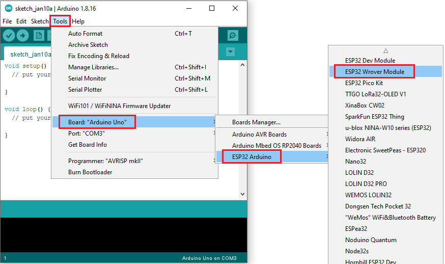


Set the board type as follows;


Then select the correct COM port (you can see the corresponding COM port after the driver is successfully installed).


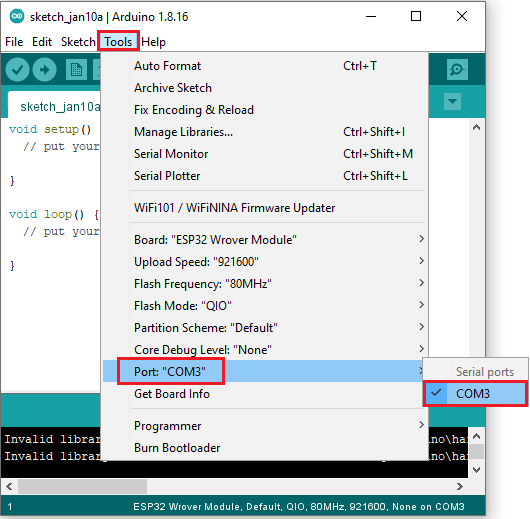

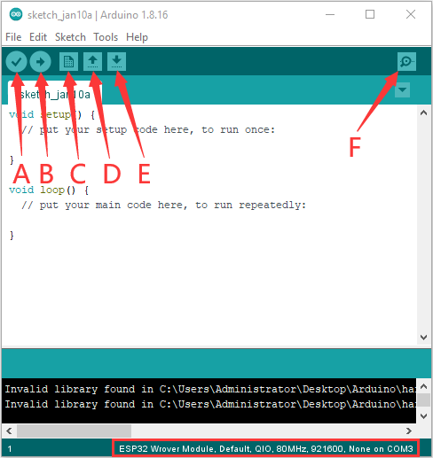

A- Used to verify whether there is any compiling mistakes or not.

B- Used to upload the sketch to your Arduino board.

C- Used to create shortcut window of a new sketch.

D- Used to directly open an example sketch.

E- Used to save the sketch.

F- Used to send the serial data received from board to the serial monitor.

### Mac System


#### 2.1 Download Arduino IDE:


#### 2.2 How to install the CP2102 driver：

If you have installed the driver, just skip it.

Connect the ESP32 board to your computer, and open Arduino IDE.

Click **Tools→Board:ESP32 Dev Module and /dev/cu.usbserial-0001.**

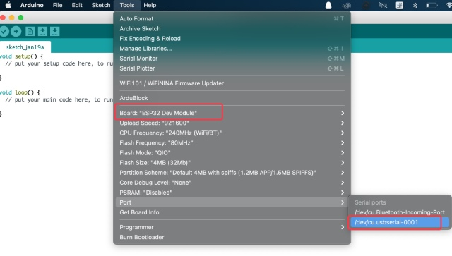

Click  to upload code.

Note: If code is uploaded unsuccessfully, you need to install the driver of CP2102, please continue to follow the instructions as below:

Download the driver of CP2102:

<https://www.silabs.com/products/development-tools/software/usb-to-uart-bridge-vcp-drivers>

Select Mac OSX edition, as shown below;


Unzip the downloaded package.


Open folder and double-click **SiLabsUSBDriverDisk.dmg** file.


You will view the following files as follows:


Double-click “Install CP210x VCP Driver”, tick D**on’t warn me when opening application on this** **disk image** and tap “ **Open”.**


Click“**Continue**”


Tap **Agree,** and **Continue**


Click **Continue** and input your password.


**Select** “**Select Open Security Preferences**”.

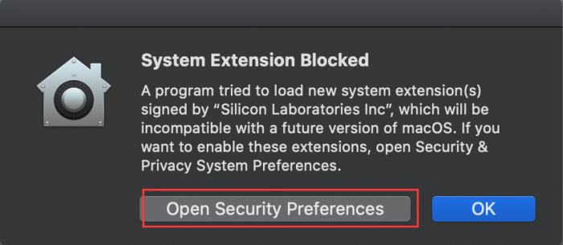

Click the lock to unlock security & privacy preference.


Tap **Unlock and** enter **your Username and password，**then click **Allow.**

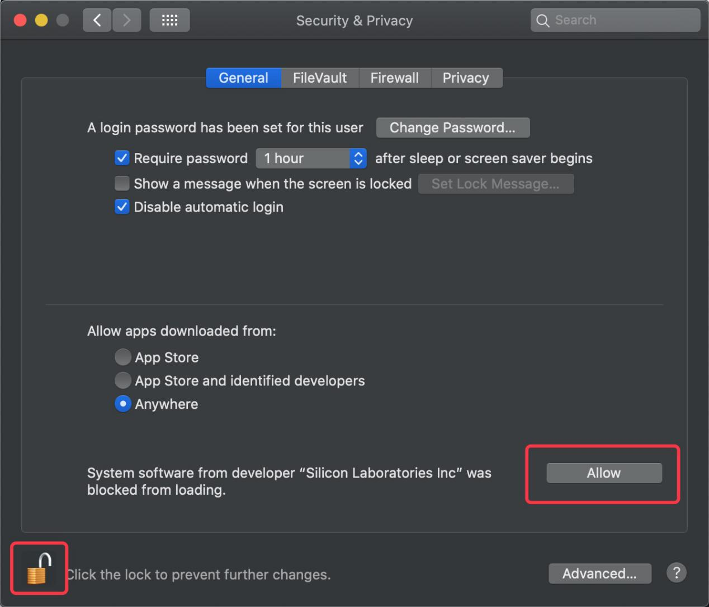

Back to installation page, and wait to install.


Successfully installed


Then enter ArduinoIDE, click **Tools** and select Board **ESP32 Dev Module** and the serial port is“**/dev/cu.SLAB\_USBtoUAPT.**


Click to upload code and show“Done uploading”.

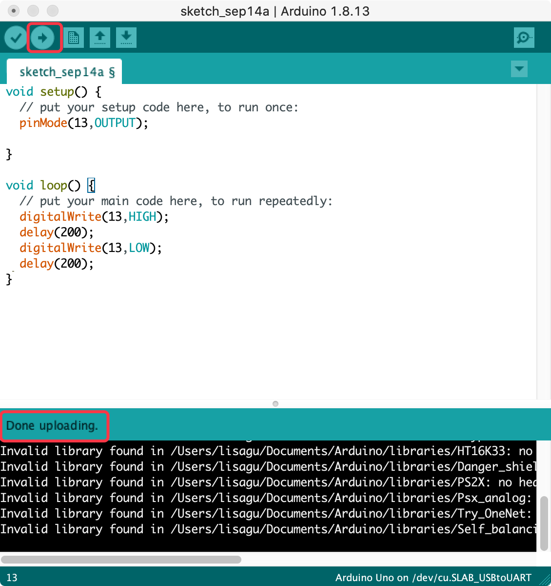

### How to Add Libraries?

**(1) What are Libraries ?**

[Libraries ](https://www.arduino.cc/en/Reference/Libraries)are a collection of code that make it easy for you to connect sensors, displays, modules, etc.

For example, the built-in LiquidCrystal library helps talk to LCD displays. There are hundreds of additional libraries available on the Internet for download.

The built-in libraries and some of these additional libraries are listed in the reference. (https://www.arduino.cc/en/Reference/Libraries)

**(2) How to Install a Library ?**

Here we will introduce the most simple way to add libraries .

**Step 1:** After downloading well the Arduino IDE, you can right-click the icon of Arduino IDE to find the option "Open file location" .

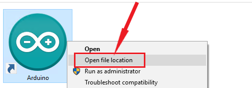

**Step 2:** Click **Open file location** \>libraries


**Step 3:** Next, find out the“libraries”folder


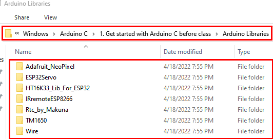

Copy in the libraries folder of Arduino.

Then click“Replace the files in the destination”.


                    

## Arduino C library,CP2102 driver and set up the ESP32 environment:

The Arduino C library needs to add in this tutorial is saved in the file “Arduino Libraries”. At the same time, the Arduino IDE.
installation，CP2102 driver installation and set up the ESP32 environment please refer to the file “Get started with Arduino C”.


## Single Sensor/Experiment Projects：

When we get the kit, we can see that there are 24 sensors/modules in the kit, which contain the corresponding ESP32 mainboard, ESP32 Expansion Board and wirings. Here, we will connect the 24 sensors individually to the ESP32 mainboard and the ESP32 Expansion Board using the wirings. Then run the corresponding code to test the function of each sensor separately. Our next projects are work to study the principles of individual modules/sensors from simple to complex as well as some extended applications of sensors to consolidate and deepen our understanding of the kits.

Note : When connecting the module/sensor wirings in the projects, the wiring method and position must be followed in the document. What’s more, do not misconnect the power supply and signal pins, otherwise there may be no experimental results or damage to the modules/sensors.  

### Project 1: Hello World

**Overview**

For ESP32 beginners, we will start with some simple things. In this project, you only need a ESP32 mainboard, a USB cable and a computer to complete the "Hello World\!" project, which is a test of communication between the ESP32 mainboard and the computer as well as a primary project.

**Components**

|  | 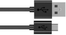 |
| ------------------------------------------------------------ | ------------------------------------------------------------ |
| ESP32*1                                                      | USB Cable*1                                                  |


**Wiring Diagram：**

In this project, we will use a USB cable to connect the ESP32 to a computer.


**Test Code**


```c
//*************************************************************************************
/*
 * Filename    : Hello World
 * Description : Enter the letter R,and the serial port displays"Hello World".
 * Auther      :http//www.keyestudio.com
*/
char val;// defines variable "val"
void setup()
{
Serial.begin(9600);// sets baudrate to 9600
}
void loop()
{
  if (Serial.available() > 0) {
    val=Serial.read();// reads symbols assigns to "val"
    if(val=='R')// checks input for the letter "R"
    {  // if so,    
     Serial.println("Hello World!");// shows “Hello World !”.
    }
  }
}
//*************************************************************************************
```


Before uploading the test code to the ESP32，click“Tools”→“Board”，select“ESP32 Wrover Module”.


Select the correct serial port.

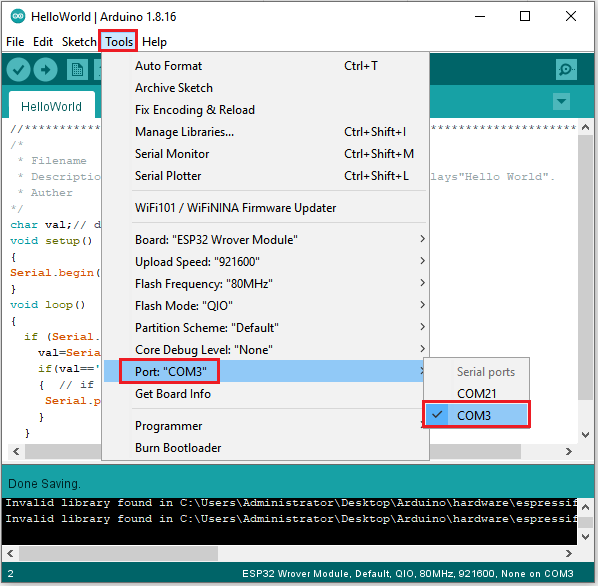

Note：For macOS users, if the upload fails, set the baud rate to 115200 before clicking .


Clickto upload the test code to the ESP32.

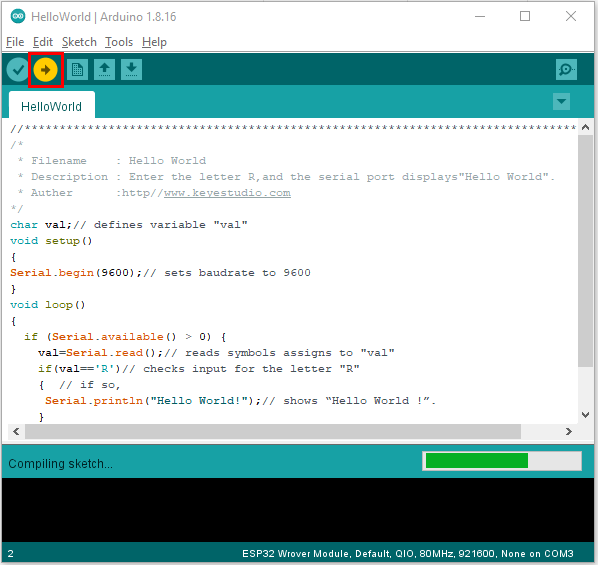

Note: If the uploading code fails, you can press and hold the Boot button on the ESP32 after clickingand release it after the percentage of uploading progress appears., as shown below:  


The code is uploaded successfully.


**Test Result**

After uploading successfully，we will use a USB cable to power on，click to enter the serial monitor and set the baud rate to 9600，enter the letter“R”，click“Send”，then the serial monitor prints“Hello World\!”.

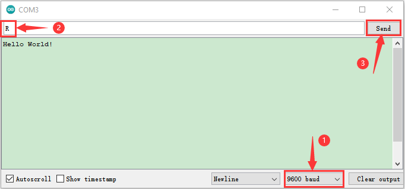

### Project 2: Lighting up LED


**Overview**

There is a Keyestudio Purple Module in this kit, which is very simple to control. If you want to light up the LED, you just need to make a certain voltage across it.

In the project, we will control the high and low level of the signal end S through programming, so as to control the LED on and off. 

**Working Principle**

The two circuit diagrams are given.

The left one is wrong wiring-up diagram. Theoretically, when the S terminal outputs high levels, the LED will receive the voltage and light up.

Due to limitation of IO ports of ESP32 board, weak current can’t make LED brighten.

The right one is correct wiring-up diagram. GND and VCC are powered up. When the S terminal is a high level, the triode Q1 will be connected and LED will light up(note: current passes through LED and R3 to reach GND by VCC not IO ports). Conversely, when the S terminal is a low level, the triode Q1 will be disconnected and LED will go off.

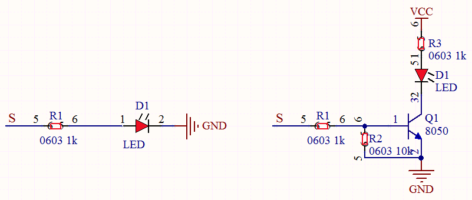

**Components**


**Wiring Diagram**


**Test Code**


```c
//*************************************************************************************
/*
 * Filename    : Blink
 * Description : led Flashing 1 s
 * Auther      : http://www.keyestudio.com
*/
int ledPin = 0; //Define LED pin connection to GPIO0
void setup() {
  pinMode(ledPin, OUTPUT);//Set mode to output
}

void loop() {
  digitalWrite(ledPin, HIGH); //Output high level, turn on led
  delay(1000);//Delay 1000 ms
  digitalWrite(ledPin, LOW); //Output low level,turn off led
  delay(1000);//Delay 1000 ms
}
//*************************************************************************************
```


**Code Explanation**

1\. PinMode(pin,mode): Pin is the ESP32 GPIO pin number used to set the mode, here we set pin 0 as output mode.

2\. DigitalWrite(pin, value): Pin is the GPIO pin, which is defined GP0 here. Valueis the digital level that we will output（HIGH/LOW. If the pin is configured to OUTPUT using pinMode(), its voltage is set to the corresponding value: 3.3V is HIGH, low level is 0V (ground). When connect the LEDs to the pins, using the digitalWrite（HIGH）, the LEDs will get dim.

3\. Setup() executes once, while loop() executes all the time. Delay(ms) is delay function, ms is the number of milliseconds to pause. Data type: unsigned long（range 0\~ 4,294,967,295 (2^32 - 1)）.

Firstly, we connect the module signal to ledPIN, namely GP0, and set it to a high level to light the LEDs on the module. Then delay 1000 ms, controlling the LEDs on the module light up for 1s and off for 1s to achieve the flashing effect. 

**Test Result**

Connect the wires according to the experimental wiring diagram, compile and upload the code to the ESP32. After uploading successfully，we will use a USB cable to power on, the LED in the circuit will flash alternately.

Note: If the uploading code fails, you can press and hold the Boot button on the ESP32 after clickingand release it after the percentage of uploading progress appears., as shown below:  


### Project 3: Traffic Lights Module


**Overview**

In this lesson, we will learn how to control multiple LED lights and simulate the operation of traffic lights.

Traffic lights are signal devices positioned at road intersections, pedestrian crossings, and other locations to control flows of traffic.

In this kit, we will use the traffic light module to simulate the traffic light.


**Working Principle**

In previous lesson, we already know how to control an LED. In this part, we only need to control three separated LEDs. Output high levels to the signal R(3.3V), then the red LED will be on.


**Components**


**Wiring Diagram**
    


**Test Code**


```c
//*************************************************************************************
/*
 * Filename    : Traffic_Light
 * Description : Simulated traffic lights
 * Auther      : http://www.keyestudio.com
*/
int redPin = 15;   //Red LED connected to GPIO15
int yellowPin = 2; //Yellow LED connected to GPIO2
int greenPin = 0;   //Green LED connected to GPIO0

void setup() {
  //LED interfaces are set to output mode
  pinMode(greenPin, OUTPUT);
  pinMode(yellowPin, OUTPUT);
  pinMode(redPin, OUTPUT);
}

void loop() {
  digitalWrite(greenPin, HIGH); //Lighting green LED
  delay(5000);  //Delay for 5 seconds
  digitalWrite(greenPin, LOW); //Turn off green LEDS
  for (int i = 1; i <= 3; i = i + 1) {  //run three times
    digitalWrite(yellowPin, HIGH); //Lighting yellow LED
    delay(500); //Delay for 0.5 seconds
    digitalWrite(yellowPin, LOW); //Turn off yellow LED
    delay(500); //Delay for 0.5 seconds
  }
  digitalWrite(redPin, HIGH); //Lighting red LED
  delay(5000);  //Delay5s
  digitalWrite(redPin, LOW); //Turn off red LED
}
//*************************************************************************************
```


**Code Explanation**

Create pins, set pins mode and delayed functions.

We use the function for(). for (int i = 1; i \<= 3; i = i + 1) represents the variable i adds 1 fir each time from 1 to 3.

The function for (int i = 255; i \>= 0; i = i - 1) indicates that i reduces by 1 each time. When i\<0, exit the for() loop and execute 256
times.


**Test Result**

Connect the wires according to the experimental wiring diagram, compile and upload the code to the ESP32. After uploading successfully，we will use a USB cable to power on，the green LED will be on for 5s then off, the yellow LED will flash for 3s then go off and the red one will be on for 5s then off, the three LED modules will simulate the circulation of traffic lights automatically.

### Project 4: Breathing LED


**Overview**

A“breathing LED”is a phenomenon where an LED's brightness smoothly changes from dark to bright and back to dark, continuing to do so and giving the illusion of an LED“breathing. This phenomenon is similar to a lung breathing in and out. So how to control LED’s brightness? We need to take advantage of PWM.

**Components**


**Connection Diagram**


**Test Code**


```c
//**********************************************************************
/*
 * Filename    : Breathing Led
 * Description : Make led light fade in and out, just like breathing.
 * Auther      : http//www.keyestudio.com
*/
#define PIN_LED   0   //define the led pin
#define CHN       0   //define the pwm channel
#define FRQ       1000  //define the pwm frequency
#define PWM_BIT   8     //define the pwm precision
void setup() {
  ledcSetup(CHN, FRQ, PWM_BIT); //setup pwm channel
  ledcAttachPin(PIN_LED, CHN);  //attach the led pin to pwm channel
}

void loop() {
  for (int i = 0; i < 255; i++) { //make light fade in
    ledcWrite(CHN, i);
    delay(10);
  }
  for (int i = 255; i > -1; i--) {  //make light fade out
    ledcWrite(CHN, i);
    delay(10);
  }
}
//*************************************************************************************
```


**Test Result**

Connect the wires according to the experimental wiring diagram, compile and upload the code to the ESP32. After uploading successfully，we will use a USB cable to power on，then the LED on the module gradually gets dimmer then brighter, cyclically, like human breathe.

### Project 5: RGB Module


**Overview**
    


Among these modules is a RGB module. It adopts a F10-full color RGB foggy common cathode LED. We connect the RGB module to the PWM port of MCU and the other pin to GND(for common anode RGB, the rest pin will be connected to VCC). So what is PWM?

PWM is a means of controlling the analog output via digital means. Digital control is used to generate square waves with different duty cycles (a signal that constantly switches between high and low levels) to control the analog output.In general, the input voltages of ports are 0V and 5V. What if the 3V is required? Or a switch among 1V, 3V and 3.5V? We cannot change resistors constantly. For this reason, we resort to PWM.

For Arduino digital port voltage outputs, there are only LOW and HIGH levels, which correspond to the voltage outputs of 0V and 5V respectively. You can define LOW as“0”and HIGH as“1’, and let the Arduino output five hundred‘0’or“1”within 1 second. If output five hundred‘1’, that is 5V; if all of which is‘0’,that is 0V; if output 250 01 pattern, that is 2.5V.

This process can be likened to showing a movie. The movie we watch are not completely continuous. Actually, it generates 25 pictures per second, which cannot be told by human eyes. Therefore, we mistake it as a continuous process. PWM works in the same way. To output different voltages, we need to control the ratio of 0 and 1. The more‘0’or‘1’ output per unit time, the more accurate the control.

**Working Principle**

For our experiment, we will control the RGB module to display different colors through three PWM values.


**Components**


**Connection Diagram**


**Test Code**


```c
//**********************************************************************
/*
 * Filename    : RGB LED
 * Description : Use RGBLED to show random color.
 * Auther      : http//www.keyestudio.com
*/
int ledPins[] = {0, 2, 15};    //define red, green, blue led pins
const byte chns[] = {0, 1, 2};        //define the pwm channels
int red, green, blue;
void setup() {
  for (int i = 0; i < 3; i++) {   //setup the pwm channels,1KHz,8bit
    ledcSetup(chns[i], 1000, 8);
    ledcAttachPin(ledPins[i], chns[i]);
  }
}

void loop() {
  red = random(0, 256);
  green = random(0, 256);
  blue = random(0, 256);
  setColor(red, green, blue);
  delay(200);
}

void setColor(byte r, byte g, byte b) {
  ledcWrite(chns[0], 255 - r); //Common anode LED, low level to turn on the led.
  ledcWrite(chns[1], 255 - g);
  ledcWrite(chns[2], 255 - b);
}
//*************************************************************************************
```


**Test Result**

Connect the wires according to the experimental wiring diagram, compile and upload the code to the ESP32. After uploading successfully，we will use a USB cable to power on，then the RGB LED on the module starts to display random colors.

### Project 6: Button Sensor


**Overview**

In this kit, there is a Keyestudio single-channel button module, which mainly uses a tact switch and comes with a yellow button cap.

In previous lessons, we learned how to make the pins of our single-chip microcomputer output a high level or low level. In this experiment, we will read the high level (3.3V) and low level (0V).

We can determine whether the button on the sensor is pressed by reading the high and low level of the S terminal on the sensor.

**Working Principle**


The button module has four pins. The pin 1 is connected to the pin 3 and the pin 2 is linked with the pin 4. When the button is not pressed, they are disconnected. Yet, when the button is pressed, they are connected. If the button is released, the signal end
is high level.

**Components**


**Connection Diagram**


**Test Code**


```c
//*************************************************************************************
/*
 * Filename    : button
 * Description : Read key value
 * Auther      : http://www.keyestudio.com
*/
int val = 0;  //Useto store key values
int button = 15; //The pin of the button is connected to GP15
void setup() {
  Serial.begin(9600); //Start the serial port monitor and set baud rate to 9600
  pinMode(button, INPUT); //Set key pin to input mode
}

void loop() {
  val = digitalRead(button);  //Read the value of the key and assign it to the variable val
  Serial.print(val);  //Print it on the serial port
  if (val == 0) { //Press the key to read the low level and print the press related information
    Serial.print("        ");
    Serial.println("Press the botton");
    delay(100);
  }

  else {  //Print information about key release
    Serial.print("        ");
    Serial.println("Loosen the botton");
    delay(100);
  }
}
//*************************************************************************************
```


**Code Explanation**

**1. pinMode(button, INPUT)**; set the pin of the button module to GP15 and INPUT.

Configure INPUT through pinMode(). INPUT must use the pull-up or pull-down resistor(ours module has the pull-up resistor R1).

**2. Serial.begin(9600)**: Initialize serial communication and set the baud rate to 9600.

**3. digitalRead(button)**: read the digital level of the button(HIGH or LOW). If this pin is not connected to pins, the digitalRead() will
return HIGH or LOW.

**4. if..else..**：if the logic behind () is true, execute the code of (); otherwise execute the code of **else**.

5\. If the button is pressed, the signal end is low level, GP15 is low level and Val is 0. Then the monitor will show the corresponding value and characters; otherwise, the sensor is released, val is 1 and monitor will show 1 and other characters

**Test Result**

Connect the wires according to the experimental wiring diagram, compile and upload the code to the ESP32. After uploading successfully，we will use a USB cable to power on，open the serial monitor and set the baud rate to 9600. The serial monitor will display the corresponding data and characters. When the button is pressed, val is 0, the monitor will show“Press the button”；when released, val is 1，the monitor will show“Loosen the button”; as shown below

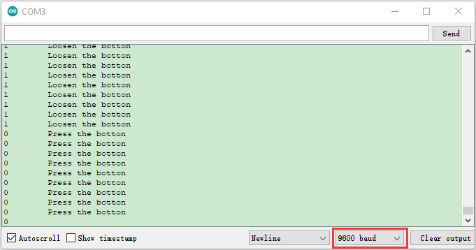

### Project 7: Obstacle Avoidance Sensor


**Overview**

In this kit, there is a Keyestudio obstacle avoidance sensor, which mainly uses an infrared emitting and a receiving tube. In the
experiment, we will determine whether there is an obstacle by reading the high and low level of the S terminal on the sensor.

**Working Principle**

NE555 circuit provides IR signals with frequency to the emitter TX, then the IR signals will fade with the increase of transmission distance. If encountering the obstacle, it will be reflected back.

When the receiver RX meets the weak signals reflected back, the receiving pin will output high levels, which indicates the obstacle is far away. On the contrary, it the reflected signals are stronger, low levels will be output, which represents the obstacle is close. There are two potentiometers on the module, and one is for adjusting emission power, another one is for receiving frequency.


**Components**


**Connection Diagram**


**Test Code**


```c
//*************************************************************************************
/*
 * Filename    : obstacle avoidance sensor
 * Description : Reading the obstacle avoidance value
 * Auther      : http://www.keyestudio.com
*/
int val = 0;
void setup() {
  Serial.begin(9600);//Set baud rate to 9600
  pinMode(15, INPUT);//Set pin GP15 to input mode
}

void loop() {
  val = digitalRead(15);//Read digital level
  Serial.print(val);//Print the level signal read
  if (val == 0) {//Obstruction detected
    Serial.print("        ");
    Serial.println("There are obstacles");
    delay(100);
  }
  else {//No obstructions detected
    Serial.print("        ");
    Serial.println("All going well");
    delay(100);
  }
}
//*************************************************************************************
```


**Code Explanation**

**Note:**

Upload the test code and wire up according to the connection diagram. After powering on, we start to adjust the two potentiometers to sense distance.

1. Adjust the potentiometer transmitting power. Make the P LED at the critical point of ON and OFF states.

2. Adjust the potentiometer receiving frequency. Rotate it clockwisely, the frequency will increase. Make the S LED at the critical point of ON and OFF states, then the 38KHz square wave can be produced.

**Test Result**

Connect the wires according to the experimental wiring diagram, compile and upload the code to the ESP32. After uploading successfully，we will use a USB cable to power on，open the serial monitor and set the baud rate to 9600. The serial monitor will display the corresponding data and characters. When the sensor detects the obstacle, the val is 0, the monitor will show“There are obstacles”; if the obstacle is not detected, the val is 1,“All going well” will be shown.

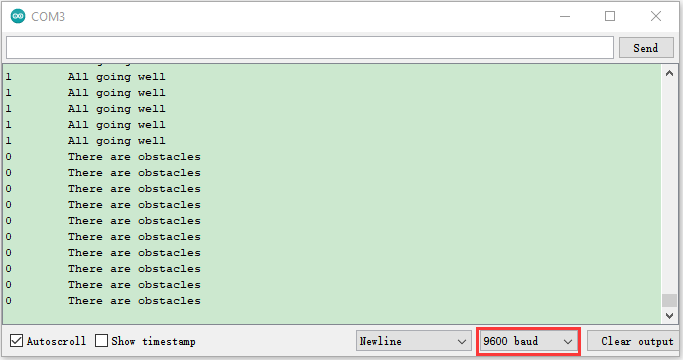

### Project 8: Tilt Module


**Overview**

In this kit, there is a Keyestudio tilt sensor. The tilt switch can output signals of different levels according to whether the module is
tilted. There is a ball inside. When the switch is higher than the horizontal level, the switch is turned on, and when it is lower than the horizontal level, the switch is turned off. This tilt module can be used for tilt detection, alarm or other detection.

**Working Principle**

The working principle is pretty simple. When pin 1 and 2 of the ball switch P1 are connected, the signal S is low level and the red LED will light up; when they are disconnected, the pin will be pulled up by the 4.7K R1 and make S a high level, then LED will be off.


**Components**


**Connection Diagram**


**Test Code**

```c
//*************************************************************************************
/*
 * Filename    : Tilt switch
 * Description : Reading the tilt sensor value
 * Auther      :http://www.keyestudio.com
*/
int val; //Store the level value output by the tilt sensor

void setup() {
  Serial.begin(9600);
  pinMode(15, INPUT);  //Connect the pin of the tilt sensor to GP15 and set GP15 to the input mode
}

void loop() {
  val = digitalRead(15); //Read module level signal
  Serial.println(val);  //Newline print
  delay(100); //Delay for 100 ms
}
//*************************************************************************************
```


**Test Result**

Connect the wires according to the experimental wiring diagram, compile and upload the code to the ESP32. After uploading successfully，we will use a USB cable to power on，open the serial monitor and set the baud rate to 9600. Make the tilt module incline to one side, the red LED on the module will be off and the monitor will display“1”. In contrast, if you make it incline the other side, the red LED will light up and the monitor will display“0”.

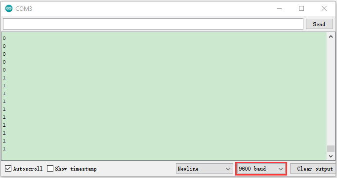

### Project 9: Reed Switch Module


**Overview**

In this kit, there is a Keyestudio reed switch module, which mainly uses a MKA10110 green reed component.

The reed switch is the abbreviation of the dry reed switch. It is a passive electronic switch element with contacts.

It has the advantages of simple structure, small size and easy control.

Its shell is a sealed glass tube with two iron elastic reed electric plates.

In the experiment, we will determine whether there is a magnetic field near the module by reading the high and low level of the S terminal on the module; and, we display the test result in the shell.

**Working Principle**

In normal conditions, the glass tube in the two reeds made of special materials are separated. When a magnetic substance close to the glass tube, in the role of the magnetic field lines, the pipe within the two reeds are magnetized to attract each other in contact, the reed will suck together, so that the junction point of the connected circuit communication.


After the disappearance of the outer magnetic reed because of their flexibility and separate, the line is disconnected. The sensor uses this characteristic to build a circuit to convert magnetic field signal into high and low level signal.  

**Components**


**Connection Diagram**


**Test Code**


```c
//*************************************************************************************
/*
 * Filename    : Reed Switch
 * Description : Read the value of the reed sensor
 * Auther      : http://www.keyestudio.com
*/
int val = 0;
int reedPin = 15; //Define dry reed module signal pin connected to GPIO15
void setup() {
  Serial.begin(9600);//Set baud rate to 9600
  pinMode(reedPin, INPUT);//Set mode to input
}

void loop() {
  val = digitalRead(reedPin);//Read digital level
  Serial.print(val);//Serial port shows up

  if (val == 0) {//There's a magnetic field nearby
    Serial.print("        ");
    Serial.println("A magnetic  field");
    delay(100);
  }
  else {//There is no magnetic field
    Serial.print("        ");
    Serial.println("There is no magnetic field");
    delay(100);
  }
}
//*************************************************************************************
```


**Test Result**

Connect the wires according to the experimental wiring diagram, compile and upload the code to the ESP32. After uploading successfully，we will use a USB cable to power on，open the serial monitor and set the baud rate to 9600. The serial monitor will display the corresponding data and characters.

When the sensor detects a magnetic field, val is 0 and the red LED of the module lights up, "0 A magnetic field" will be displayed; when no magnetic field is detected, val is 1, and the LED on the module goes out, "1 There is no magnetic field" will be shown, as shown below.


### Project 10: PIR Motion Sensor


**Overview**

In this kit, there is a Keyestudio PIR motion sensor, which mainly uses an RE200B-P sensor elements. It is a human body pyroelectric motion sensor based on pyroelectric effect, which can detect infrared rays emitted by humans or animals, and the Fresnel lens can make the sensor's detection range farther and wider.

In the experiment, we determine if there is someone moving nearby by reading the high and low levels of the S terminal on the module. The detected results will be displayed on the Shell.

**Working Principle**

The upper left part is voltage conversion(VCC to 3.3V). The working voltage of sensors we use is 3.3V, therefore we can’t use 5V directly. The voltage conversion circuit is needed.

When no person is detected or no infrared signal is received, and pin 1 of the sensor outputs low level. At this time, the LED on the module will light up and the MOS tube Q1 will be connected and the signal terminal S will detect Low levels.

When one is detected or an infrared signal is received, and pin 1 of the sensor outputs a high level. Then LED on the module will go off, the MOS tube Q1 is disconnected and the signal terminal S will detect high levels.


**Required Components**


**Connection Diagram**


**Test Code**


```c
//*************************************************************************************
/*
 * Filename    : PIR motion
 * Description : Reading the value of the human body infrared sensor
 * Auther      :  http://www.keyestudio.com
*/
int val = 0;
int pirPin = 15; //The pin of PIR motion sensor is defined as GPIO15
void setup() {
  Serial.begin(9600); //Set baud rate to 9600
  pinMode(pirPin, INPUT);  //Set the sensor to input mode
}

void loop() {
  val = digitalRead(pirPin);  //Read the sensor value
  Serial.print(val);//Print val value
  if (val == 1) {//There is movement nearby, output high level
    Serial.print("        ");
    Serial.println("Some body is in this area!");
    delay(100);
  }
  else {//If no  movement nearby, output low level
    Serial.print("        ");
    Serial.println("No one!");
    delay(100);
  }
}
//*************************************************************************************
```


**Test Result**

Connect the wires according to the experimental wiring diagram, compile and upload the code to the ESP32. After uploading successfully，we will use a USB cable to power on，open the serial monitor and set the baud rate to 9600. The serial monitor will display the corresponding data and characters.

When the sensor detects someone nearby, value is 1, the LED will go off and the monitor will show“1 Somebody is in this area\!”. In contrast, the value is 0, the LED will go up and“0 No one\!”will be shown.


### Project 11: Active Buzzer


**Overview**

In this kit, it contains an active buzzer module and a power amplifier module (the principle is equivalent to a passive buzzer). In this experiment, we control the active buzzer to emit sounds. Since it has its own oscillating circuit, the buzzer will automatically sound if given large voltage.

**Working Principle**

From the schematic diagram, the pin of buzzer is connected to a resistor R2 and another port is linked with a NPN triode Q1. So, if this triode Q1 is powered, the buzzer will sound.

If the base electrode of the triode connected to the R1 resistor is a high level, the triode Q1 will be connected.If the base electrode is pulled down by the resistor R3, the triode is disconnected.

When we output a high level from the IO port to the triode, the buzzer will emit sounds; if outputting low levels, the buzzer won’t emit sounds.


**Components**


**Connection Diagram**


**Test Code**


```c
//*************************************************************************************
/*
 * Filename    : Active buzzer
 * Description : An active buzzer produces sound
 * Auther      : http://www.keyestudio.com
*/
int buzzer = 15; //Define buzzer receiver pin GPIO15
void setup() {
  pinMode(buzzer, OUTPUT);//Set the output mode
}

void loop() {
  digitalWrite(buzzer, HIGH); //sound production
  delay(1000);
  digitalWrite(buzzer, LOW); //Stop the sound
  delay(1000);
}
//*************************************************************************************
```


**Code Explanation**

In the experiment, we set the pin to GPIO15. When setting to high, the active buzzer will beep; when setting to low, the active buzzer will stop emitting sounds.

**Test Result**

Connect the wires according to the experimental wiring diagram, compile and upload the code to the ESP32. After uploading successfully，we will use a USB cable to power on. The active buzzer will emit sound for 1 second, and stop for 1 second.

### Project 12: 8002b Audio Power Amplifier


**Overview**

In this kit, there is a Keyestudio 8002b power amplifier. The main components of this module are an adjustable potentiometer, a speaker, and an audio amplifier chip;

The main function of this module is: it can amplify the output audio signal, with a magnification of 8.5 times, and play sound or music through the built-in low-power speaker, as an external amplifying device for some music playing equipment.

In the experiment, we used the 8002b power amplifier speaker module to emit sounds of various frequencies.

**Working Principle**

In fact, it is similar to a passive buzzer. The active buzzer has its own oscillation source. Yet, the passive buzzer does not have internal oscillation. When controlling the circuit, we need to input square waves of different frequencies to the positive pole of the component and ground the negative pole to control the buzzer to chime sounds of different frequencies.


**Components**


**Connection Diagram**

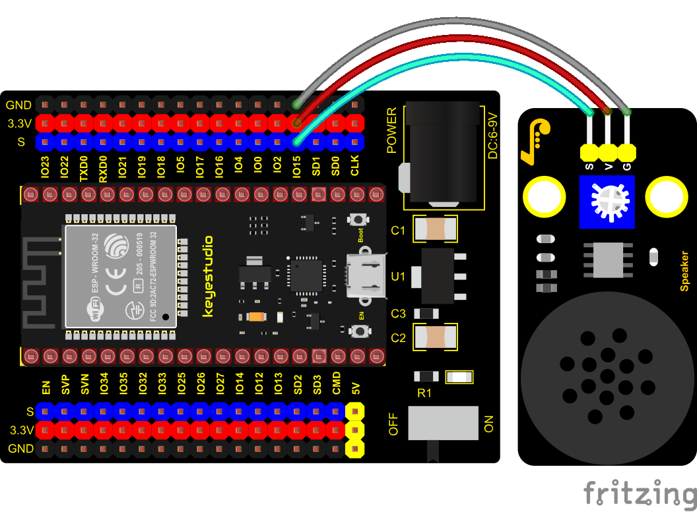

**Test Code**


```c
//**********************************************************************
/*
 * Filename    : Passive Buzzer
 * Description : Passive Buzzer sounds the alarm.
 * Auther      : http//www.keyestudio.com
*/
#define LEDC_CHANNEL_0 0

// LEDC timer uses 13 bit accuracy

#define LEDC_TIMER_13_BIT  13

// Define tool I/O ports

#define BUZZER_PIN  15

//Create a musical melody list, Super Mario

int melody[] = {330, 330, 330, 262, 330, 392, 196, 262, 196, 165, 220, 247, 233, 220, 196, 330, 392, 440, 349, 392, 330, 262, 294, 247, 262, 196, 165, 220, 247, 233, 220, 196, 330, 392,440, 349, 392, 330, 262, 294, 247, 392, 370, 330, 311, 330, 208, 220, 262, 220, 262,

294, 392, 370, 330, 311, 330, 523, 523, 523, 392, 370, 330, 311, 330, 208, 220, 262,220, 262, 294, 311, 294, 262, 262, 262, 262, 262, 294, 330, 262, 220, 196, 262, 262,262, 262, 294, 330, 262, 262, 262, 262, 294, 330, 262, 220, 196};

//Create a list of tone durations

int noteDurations[] = {8,4,4,8,4,2,2,3,3,3,4,4,8,4,8,8,8,4,8,4,3,8,8,3,3,3,3,4,4,8,4,8,8,8,4,8,4,3,8,8,2,8,8,8,4,4,8,8,4,8,8,3,8,8,8,4,4,4,8,2,8,8,8,4,4,8,8,4,8,8,3,3,3,1,8,4,4,8,4,8,4,8,2,8,4,4,8,4,1,8,4,4,8,4,8,4,8,2};
void setup() {
pinMode(BUZZER_PIN, OUTPUT); // Set the buzzer to output mode
}

void loop() {

  int noteDuration; //Create a variable of noteDuration

  for (int i = 0; i < sizeof(noteDurations); ++i)

  {
      noteDuration = 800/noteDurations[i];

      ledcSetup(LEDC_CHANNEL_0, melody[i]*2, LEDC_TIMER_13_BIT);

      ledcAttachPin(BUZZER_PIN, LEDC_CHANNEL_0);

      ledcWrite(LEDC_CHANNEL_0, 50);

      delay(noteDuration * 1.30); //delay
  }
}
//**********************************************************************
```


**Test Result**

Connect the wires according to the experimental wiring diagram, compile and upload the code to the ESP32. After uploading successfully，we will use a USB cable to power on，then the power amplifier module will emit the sound on a loop.

### Project 13: Potentiometer


**Overview**

The following we will introduce is the Keyestudio rotary potentiometer which is an analog sensor.

The digital IO ports can read the voltage value between 0 and 3.3V and the module only outputs high levels. However, the analog sensor can read the voltage value through 16 ADC analog ports on the ESP32 board. In the experiment, we will display the test results on the Shell.

**Working Principle**


It uses a 10K adjustable resistor. We can change the resistance by rotating the potentiometer. The signal S can detect the voltage
changes(0-3.3V) which are analog quantity.

**ADC：**The more bits an ADC has, the denser the partitioning of the simulation, the higher the accuracy of the final conversion.


The conversion formula is as follows:

**DAC：**The higher the precision of DAC, the higher the precision of the output voltage value.  

The conversion formula is as follows:  

**ADC on ESP32：**

The ESP32 has 16 pins that can be used to measure analog signals. GPIO pin serial numbers and analog pin definitions are shown below:  

<table class="colwidths-auto docutils align-default">
<tbody>
<tr class="odd">
<td>ADC number in ESP32</td>
<td>ESP32 GPIO number</td>
</tr>
<tr class="even">
<td>ADC0</td>
<td>GPIO 36</td>
</tr>
<tr class="odd">
<td>ADC3</td>
<td>GPIO 39</td>
</tr>
<tr class="even">
<td>ADC4</td>
<td>GPIO 32</td>
</tr>
<tr class="odd">
<td>ADC5</td>
<td>GPIO33</td>
</tr>
<tr class="even">
<td>ADC6</td>
<td>GPIO34</td>
</tr>
<tr class="odd">
<td>ADC7</td>
<td>GPIO 35</td>
</tr>
<tr class="even">
<td>ADC10</td>
<td>GPIO 4</td>
</tr>
<tr class="odd">
<td>ADC11</td>
<td>GPIO0</td>
</tr>
<tr class="even">
<td>ADC12</td>
<td>GPIO2</td>
</tr>
<tr class="odd">
<td>ADC13</td>
<td>GPIO15</td>
</tr>
<tr class="even">
<td>ADC14</td>
<td>GPIO13</td>
</tr>
<tr class="odd">
<td>ADC15</td>
<td>GPIO 12</td>
</tr>
<tr class="even">
<td>ADC16</td>
<td>GPIO 14</td>
</tr>
<tr class="odd">
<td>ADC17</td>
<td>GPIO27</td>
</tr>
<tr class="even">
<td>ADC18</td>
<td>GPIO25</td>
</tr>
<tr class="odd">
<td>ADC19</td>
<td>GPIO26</td>
</tr>
</tbody>
</table>

**DAC on ESP32：**

The ESP32 has two 8-bit digital-to-analog converters connected to GPIO25 and GPIO26 pins, which are immutable, as shown below :

<table class="colwidths-auto docutils align-default">
<tbody>
<tr class="odd">
<td>Simulate pin number</td>
<td>GPIO number</td>
</tr>
<tr class="even">
<td>DAC1</td>
<td>GPIO25</td>
</tr>
<tr class="odd">
<td>DAC2</td>
<td>GPIO26</td>
</tr>
</tbody>
</table>
**Components**


**Connection Diagram**


**Test Code**


```c
//**********************************************************************************
/*  
 * Filename    : Rotary_potentiometer
 * Description : Read the basic usage of ADC，DAC and Voltage
 * Auther      : http//www.keyestudio.com
*/
#define PIN_ANALOG_IN  34  //the pin of the Potentiometer

void setup() {
  Serial.begin(9600);
}

//In loop()，the analogRead() function is used to obtain the ADC value, 
//and then the map() function is used to convert the value into an 8-bit precision DAC value. 
//The input and output voltage are calculated according to the previous formula, 
//and the information is finally printed out.
void loop() {
  int adcVal = analogRead(PIN_ANALOG_IN);
  int dacVal = map(adcVal, 0, 4095, 0, 255);
  double voltage = adcVal / 4095.0 * 3.3;
  Serial.printf("ADC Val: %d, \t DAC Val: %d, \t Voltage: %.2fV\n", adcVal, dacVal, voltage);
  delay(200);
}
//**********************************************************************************
```

**Code Explanation**

1\. analogVal means analog value. The rotary potentiometer outputs analog values(0\~4095), therefore, we set pins to analog ports. For example, we connect to GPIO34.

2\. analogRead(pin): read the value of the specified analog pin. The ESP32 contains a multi-channel, 12-bit converter. This means that it will map the input voltage between 0 and the working voltage (5V or 3.3V) to an integer value between 0 and 4095. For example, this will produce a resolution among readings: 3.3V/4096 stands for 0.0008V per unit.

3\. The map() function converts this 12-bit DAC value to an 8-bit DAC value.  

4\. Pin: the name of analog input pin.

5\. The serial monitor displays the values of adcVal, dacVal, voltage, the baud rate must be set before display (we default to 9600, which can be changed).  

**Test Result**

Connect the wires according to the experimental wiring diagram, compile and upload the code to the ESP32. After uploading successfully，we will use a USB cable to power on, open the serial monitor and set the baud rate to 9600. The serial monitor will display the potentiometer's ADC value, DAC value and voltage value. Rotate the potentiometer handle, the analog values will change.


### Project 14: Sound Sensor


**Overview**

In this kit, there is a Keyestudio DIY electronic block and a sound sensor. In the experiment, we test the analog value corresponding to the sound level in the current environment with it. The louder the sound, the larger the ADC, DAC and the voltage value, and the “shell” window will display the test results.

**Working Principle**

It uses a high-sensitive microphone component and an LM386 chip. We build the circuit with the LM386 chip and amplify the sound through the high-sensitive microphone. In addition, we can adjust the sound volume by the potentiometer. Rotate it clockwise, the sound will get louder.


**Components**


**Connection Diagram**


**Test Code**


```c
//**********************************************************************************
/*  
 * Filename    : Photoresistance
 * Description : Read the basic usage of ADC，DAC and Voltage
 * Auther      : http//www.keyestudio.com
*/
#define PIN_ANALOG_IN  34  //the pin of the Photoresistance

void setup() {
  Serial.begin(9600);
}

//In loop()，the analogRead() function is used to obtain the ADC value, 
//and then the map() function is used to convert the value into an 8-bit precision DAC value. 
//The input and output voltage are calculated according to the previous formula, 
//and the information is finally printed out.
void loop() {
  int adcVal = analogRead(PIN_ANALOG_IN);
  int dacVal = map(adcVal, 0, 4095, 0, 255);
  double voltage = adcVal / 4095.0 * 3.3;
  Serial.printf("ADC Val: %d, \t DAC Val: %d, \t Voltage: %.2fV\n", adcVal, dacVal, voltage);
  delay(200);
}
//**********************************************************************************
```


**Test Result**

Connect the wires according to the experimental wiring diagram, compile and upload the code to the ESP32. After uploading successfully，we will use a USB cable to power on, open the serial monitor and set the baud rate to 9600. The serial monitor will display the sound sensor’s ADC value, DAC value and voltage value. Rotate the potentiometer clockwise and speak at the MIC. Then you can see the analog value get larger, as shown below:


### Project 15: Photoresistor

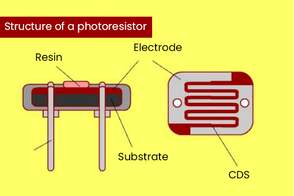

**Description**

In this kit, there is a photoresistor consists of photosensitive resistance elements. Its resistance changes with the light intensity.
Also, it converts the resistance change into a voltage change through the characteristic of the photosensitive resistive element. When wiring it up, we interface its signal terminal (S terminal) with the analog port of ESP32 , so as to sense the change of the analog value, and display the corresponding analog value in the shell.

**Working Principle**

If there is no light, the resistance is 0.2MΩ and the detected voltage at the terminal 2 is close to 0. When the light intensity increases, the resistance of photoresistor and detected voltage will diminish.


**Components**


**Connection Diagram**


**Test Code**


```c
//**********************************************************************************
/*  
 * Filename    : Photoresistance
 * Description : Read the basic usage of ADC，DAC and Voltage
 * Auther      : http//www.keyestudio.com
*/
#define PIN_ANALOG_IN  34  //the pin of the Photoresistance

void setup() {
  Serial.begin(9600);
}

//In loop()，the analogRead() function is used to obtain the ADC value, 
//and then the map() function is used to convert the value into an 8-bit precision DAC value. 
//The input and output voltage are calculated according to the previous formula, 
//and the information is finally printed out.
void loop() {
  int adcVal = analogRead(PIN_ANALOG_IN);
  int dacVal = map(adcVal, 0, 4095, 0, 255);
  double voltage = adcVal / 4095.0 * 3.3;
  Serial.printf("ADC Val: %d, \t DAC Val: %d, \t Voltage: %.2fV\n", adcVal, dacVal, voltage);
  delay(200);
}
//**********************************************************************************
```


**Test Result**

Connect the wires according to the experimental wiring diagram, compile and upload the code to the ESP32. After uploading successfully，we will use a USB cable to power on, open the serial monitor and set the baud rate to 9600. The serial monitor will display the photoresistor’s ADC value, DAC value and voltage value. When the light intensity gets stronger, the analog values will get larger, as shown below:

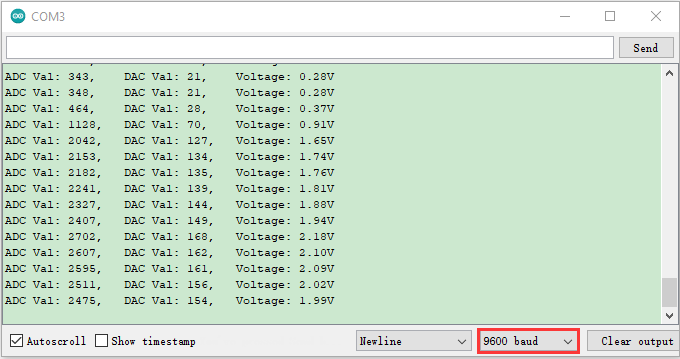

### Project 16: NTC-MF52AT Thermistor


**Overview**

In the experiment, there is a NTC-MF52AT analog thermistor. We connect its signal terminal to the analog port of the ESP32 mainboard and read the corresponding ADC value, voltage value and thermistor value.

We can use analog values to calculate the temperature of the current environment through specific formulas. Since the temperature calculation formula is more complicated, we only read the corresponding analog value.

**Working Principle**


This module mainly uses NTC-MF52AT thermistor element, which can sense the changes of the surrounding environment temperature. Resistance changes with the temperature, causing the voltage of the signal terminal S to change.

This sensor uses the characteristics of NTC-MF52AT thermistor element to convert resistance changes into voltage changes.

**Components**


**Connection Diagram**


**Test Code**


```c
//**********************************************************************************
/*  
 * Filename    : Temperature sensor
 * Description : Making a thermometer by thermistor.
 * Auther      : http//www.keyestudio.com
*/
#define PIN_ANALOG_IN   34
void setup() {
  Serial.begin(9600);
}

void loop() {
  int adcValue = analogRead(PIN_ANALOG_IN);                       //read ADC pin
  double voltage = (float)adcValue / 4095.0 * 3.3;                // calculate voltage
  double Rt = (3.3 - voltage) / voltage * 10;                     //calculate resistance value of thermistor
  double tempK = 1 / (1 / (273.15 + 25) + log(Rt / 4.7) / 3950.0); //calculate temperature (Kelvin)
  double tempC = tempK - 273.15;                                  //calculate temperature (Celsius)
  Serial.printf("ADC value : %d,\tVoltage : %.2fV, \tTemperature : %.2fC\n", adcValue, voltage, tempC);
  delay(1000);
}
//**********************************************************************************
```

**Test Result**

Connect the wires according to the experimental wiring diagram, compile and upload the code to the ESP32. After uploading successfully，we will use a USB cable to power on, open the serial monitor and set the baud rate to 9600. The serial monitor will display the thermistor’s ADC value, DAC value and voltage value, as shown below:


### Project 17: Thin-film Pressure Sensor


**Overview**

In this kit, there is a Keyestudio thin-film pressure sensor, which is composed of a new type of nano pressure-sensitive material and a comfortable ultra-thin film substrate, has waterproof and pressure-sensitive functions.

In the experiment, we determine the pressure by collecting the analog signal on the S end of the module. The smaller the ADC value, DAC value and voltage value, the greater the pressure; and the displayed results will shown on the Shell.


**Working Principle**

When the sensor is pressed by external forces, the resistance value of sensor will vary. We convert the pressure signals detected by the sensor into the electric signals through a circuit. Then we can obtain the pressure changes by detecting voltage signal changes.


**Components**


**Connection Diagram**


**Test Code**


```c
//**********************************************************************************
/*  
 * Filename    : Film pressure sensor
 * Description : Read the basic usage of ADC，DAC and Voltage
 * Auther      : http//www.keyestudio.com
*/
#define PIN_ANALOG_IN  34  //the pin of the Film pressure sensor
void setup() {
  Serial.begin(9600);
}

//In loop()，the analogRead() function is used to obtain the ADC value, 
//and then the map() function is used to convert the value into an 8-bit precision DAC value. 
//The input and output voltage are calculated according to the previous formula, 
//and the information is finally printed out.
void loop() {
  int adcVal = analogRead(PIN_ANALOG_IN);
  int dacVal = map(adcVal, 0, 4095, 0, 255);
  double voltage = adcVal / 4095.0 * 3.3;
  Serial.printf("ADC Val: %d, \t DAC Val: %d, \t Voltage: %.2fV\n", adcVal, dacVal, voltage);
  delay(200);
}
//**********************************************************************************
```

**Test Result**

Connect the wires according to the experimental wiring diagram, compile and upload the code to the ESP32. After uploading successfully，we will use a USB cable to power on, open the serial monitor and set the baud rate to 9600. The serial monitor will display the thin-film’s ADC value, DAC value and voltage value, when the thin-film is pressed by fingers, the analog value will decrease, as shown below;


### Project 18: Joystick Module


**Overview**

Game handle controllers are ubiquitous. There is a joystick module in this kit, which mainly uses PS2 joystick. When controlling it, we need to connect the X and Y ports of the module to the analog port of the single-chip microcomputer, port B to the digital port of the single-chip microcomputer, VCC to the power output port(3.3-5V), and GND to the GND of the MCU. We can read the high and low levels of two analog values and one digital port) to determine the working status of the joystick on the module.

In the project, two analog values(x axis and y axis) will be shown on Shell.

**Working Principle**


In fact, its working principle is very simple. Its inside structure is equivalent to two adjustable potentiometers and a button. When this button is not pressed and the module is pulled down by R1, low levels will be output ; on the contrary, when the button is pressed, VCC will be connected (high levels). When we move the joystick, the internal potentiometer will adjust to output different voltages, and we can read the analog value.

**Components**


**Connection Diagram**


**Test Code**


```c
//**********************************************************************************
/*  
 * Filename    : Joystick
 * Description : Read data from Rocker.
 * Auther      : http//www.keyestudio.com
*/
int xyzPins[] = {34, 35, 13};   //x,y,z pins
void setup() {
  Serial.begin(9600);
  pinMode(xyzPins[0], INPUT); //x axis. 
  pinMode(xyzPins[1], INPUT); //y axis. 
  pinMode(xyzPins[2], INPUT_PULLUP);   //z axis is a button.
}

// In loop(), use analogRead () to read the value of axes X and Y 
//and use digitalRead () to read the value of axis Z, then display them.
void loop() {
  int xVal = analogRead(xyzPins[0]);
  int yVal = analogRead(xyzPins[1]);
  int zVal = digitalRead(xyzPins[2]);
  Serial.println("X,Y,Z: " + String(xVal) + ", " +  String(yVal) + ", " + String(zVal));
  delay(500);
}
//**********************************************************************************
```


**Code Explanation**

In the experiment, according to the wiring diagram, the x pin is set to GPIO34, the y pin is set to GPIO35 and the pin of the joystick is set to GPIO13.

**Test Result**

Connect the wires according to the experimental wiring diagram, compile and upload the code to the ESP32. After uploading successfully，we will use a USB cable to power on. Open the serial monitor and set baud rate to 9600;

The serial monitor will show the corresponding value. Moving the joystick or pressing it will change the analog and digital values in the serial monitor.


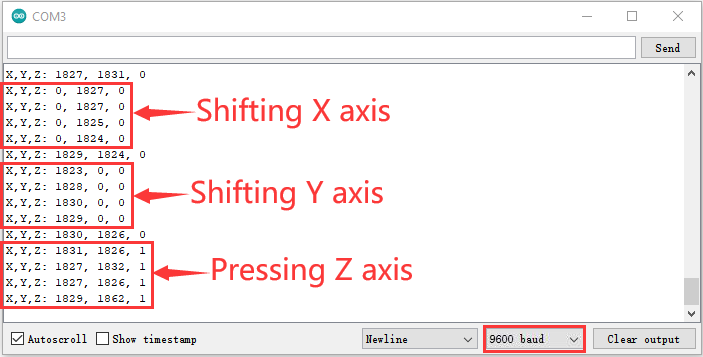

### Project 19: SK6812 RGB Module


**Overview**

In previous lessons, we learned about the plug-in RGB module and used PWM signals to color the three pins of the module.

There is a Keyestudio 6812 RGB module whose driving principle is different from the plug-in RGB module. It can only control with one pin. This is a set. It is an intelligent externally controlled LED light source with the control circuit and the light-emitting circuit. Each LED element is the same as a 5050 LED lamp bead, and each component is a pixel. There are four lamp beads on the module, which indicates four pixels.

In the experiment, we make different lights show different colors.

**Working Principle**

From the schematic diagram, we can see that these four pixel lighting beads are all connected in series. In fact, no matter how many they are, we can use a pin to control a light and let it display any color. The pixel point contains a data latch signal shaping amplifier drive circuit, a high-precision internal oscillator and a 12V high-voltage programmable constant current control part, which effectively ensures the color of the pixel point light is highly consistent.

The data protocol adopts a single-wire zero-code communication method. After the pixel is powered up and reset, the S terminal receives the data transmitted from the controller. The first 24bit data sent is extracted by the first pixel and sent to the data latch of the pixel.


**Components**


**Connection Diagram**


**Test Code**


```c
//**********************************************************************************
/*  
 * Filename    : sk6812 RGB LED
 * Description : turn on sk6812 RGB LED
 * Auther      : http//www.keyestudio.com
*/
#include <Adafruit_NeoPixel.h>

#define PIN 15

// Parameter 1 = number of pixels in strip
// Parameter 2 = Arduino pin number (most are valid)
// Parameter 3 = pixel type flags, add together as needed:
//   NEO_KHZ800  800 KHz bitstream (most NeoPixel products w/WS2812 LEDs)
//   NEO_KHZ400  400 KHz (classic 'v1' (not v2) FLORA pixels, WS2811 drivers)
//   NEO_GRB     Pixels are wired for GRB bitstream (most NeoPixel products)
//   NEO_RGB     Pixels are wired for RGB bitstream (v1 FLORA pixels, not v2)
Adafruit_NeoPixel strip = Adafruit_NeoPixel(60, PIN, NEO_GRB + NEO_KHZ800);

// IMPORTANT: To reduce NeoPixel burnout risk, add 1000 uF capacitor across
// pixel power leads, add 300 - 500 Ohm resistor on first pixel's data input
// and minimize distance between Arduino and first pixel.  Avoid connecting
// on a live circuit...if you must, connect GND first.

void setup() {
  strip.begin();
  strip.show(); // Initialize all pixels to 'off'
}

void loop() {
  // Some example procedures showing how to display to the pixels:
  colorWipe(strip.Color(255, 0, 0), 50); // Red
  colorWipe(strip.Color(0, 255, 0), 50); // Green
  colorWipe(strip.Color(0, 0, 255), 50); // Blue
  // Send a theater pixel chase in...
  theaterChase(strip.Color(127, 127, 127), 50); // White
  theaterChase(strip.Color(127,   0,   0), 50); // Red
  theaterChase(strip.Color(  0,   0, 127), 50); // Blue

  rainbow(20);
  rainbowCycle(20);
  theaterChaseRainbow(50);
}

// Fill the dots one after the other with a color
void colorWipe(uint32_t c, uint8_t wait) {
  for(uint16_t i=0; i<strip.numPixels(); i++) {
      strip.setPixelColor(i, c);
      strip.show();
      delay(wait);
  }
}

void rainbow(uint8_t wait) {
  uint16_t i, j;

  for(j=0; j<256; j++) {
    for(i=0; i<strip.numPixels(); i++) {
      strip.setPixelColor(i, Wheel((i+j) & 255));
    }
    strip.show();
    delay(wait);
  }
}

// Slightly different, this makes the rainbow equally distributed throughout
void rainbowCycle(uint8_t wait) {
  uint16_t i, j;

  for(j=0; j<256*5; j++) { // 5 cycles of all colors on wheel
    for(i=0; i< strip.numPixels(); i++) {
      strip.setPixelColor(i, Wheel(((i * 256 / strip.numPixels()) + j) & 255));
    }
    strip.show();
    delay(wait);
  }
}

//Theatre-style crawling lights.
void theaterChase(uint32_t c, uint8_t wait) {
  for (int j=0; j<10; j++) {  //do 10 cycles of chasing
    for (int q=0; q < 3; q++) {
      for (int i=0; i < strip.numPixels(); i=i+3) {
        strip.setPixelColor(i+q, c);    //turn every third pixel on
      }
      strip.show();
     
      delay(wait);
     
      for (int i=0; i < strip.numPixels(); i=i+3) {
        strip.setPixelColor(i+q, 0);        //turn every third pixel off
      }
    }
  }
}

//Theatre-style crawling lights with rainbow effect
void theaterChaseRainbow(uint8_t wait) {
  for (int j=0; j < 256; j++) {     // cycle all 256 colors in the wheel
    for (int q=0; q < 3; q++) {
        for (int i=0; i < strip.numPixels(); i=i+3) {
          strip.setPixelColor(i+q, Wheel( (i+j) % 255));    //turn every third pixel on
        }
        strip.show();
       
        delay(wait);
       
        for (int i=0; i < strip.numPixels(); i=i+3) {
          strip.setPixelColor(i+q, 0);        //turn every third pixel off
        }
    }
  }
}

// Input a value 0 to 255 to get a color value.
// The colours are a transition r - g - b - back to r.
uint32_t Wheel(byte WheelPos) {
  if(WheelPos < 85) {
   return strip.Color(WheelPos * 3, 255 - WheelPos * 3, 0);
  } else if(WheelPos < 170) {
   WheelPos -= 85;
   return strip.Color(255 - WheelPos * 3, 0, WheelPos * 3);
  } else {
   WheelPos -= 170;
   return strip.Color(0, WheelPos * 3, 255 - WheelPos * 3);
  }
}
//*************************************************************************************
```


**Test Code**

Connect the wires according to the experimental wiring diagram, compile and upload the code to the ESP32. After uploading successfully，we will use a USB cable to power on. Then we can see the four RGB LEDs show red, green, blue and white color.

### Project 20: Rotary Encoder


**Overview**

In this kit, there is a Keyestudio rotary encoder, dubbed as switch encoder. It is applied to automotive electronics, multimedia audio, instrumentation, household appliances, smart home, medical equipment and so on.

In the experiment, it it used for counting. When we rotate the rotary encoder clockwise, the set data falls by 1; if you rotate it
anticlockwise, the set data is up 1; and when the middle button is pressed, the value will be show in the serial monitor.

**Working Principle**

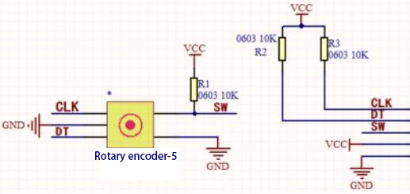  

The incremental encoder converts the displacement into a periodic electric signal, and then converts this signal into a counting pulse, and the number of pulses indicates the size of the displacement.

This module mainly uses 20pulse rotary encoder components. It can calculate the number of pulses output during clockwise and reverse rotation. There is no limit to count rotation. It resets to the initial state, that is, starts counting from 0.           

**Components**


**Connection Diagram**


**Test Code**


```c
//**********************************************************************************
/*  
 * Filename    : Encoder
 * Description : Rotary encoder module counting.
 * Auther      : http//www.keyestudio.com
*/
//Interfacing Rotary Encoder with Arduino
//Encoder Switch -> pin 27
//Encoder DT -> pin 14
//Encoder CLK -> pin 12

int Encoder_DT  = 14;
int Encoder_CLK  = 12;
int Encoder_Switch = 27;

int Previous_Output;
int Encoder_Count;

void setup() {
  Serial.begin(9600);

  //pin Mode declaration
  pinMode (Encoder_DT, INPUT);
  pinMode (Encoder_CLK, INPUT);
  pinMode (Encoder_Switch, INPUT);

  Previous_Output = digitalRead(Encoder_DT); //Read the inital value of Output A
}

void loop() {
  //aVal = digitalRead(pinA);

  if (digitalRead(Encoder_DT) != Previous_Output)
  {
    if (digitalRead(Encoder_CLK) != Previous_Output)
    {
      Encoder_Count ++;
      Serial.println(Encoder_Count);
    }
    else
    {
      Encoder_Count--;
      Serial.println(Encoder_Count);
    }
  }

  Previous_Output = digitalRead(Encoder_DT);

  if (digitalRead(Encoder_Switch) == 0)
  {
    delay(5);
    if (digitalRead(Encoder_Switch) == 0) {
      Serial.println("Switch pressed");
      while (digitalRead(Encoder_Switch) == 0);
    }
  }
}
//**********************************************************************************
```

**Code Explanation**

Set CLK to GPIO12 and DAT to GPIO14.

This code is set well in the library file. When CLK descends, read the voltage of DAT, when DAT is a HIGH level, the value of the rotary encoder is added by 1; when DAT is a LOW level, the value of the rotary encoder is cut down 1.

Set the pin of the button(GPIO27) to LOW and print.

**Test Result**

Connect the wires according to the experimental wiring diagram, compile and upload the code to the ESP32. After uploading successfully，we will use a USB cable to power on. Open the serial monitor and set baud rate to 9600.

Rotate the knob on the rotary encoder clockwise, the displayed data will decrease; on the contrary, in anticlockwise way, the data will rise. Equally, press the button on the rotary encoder,“Switch pressed”will be shown.


### Project 21: Servo Control


**Overview**

Servo is a position control rotary actuator. It mainly consists of a housing, a circuit board, a core-less motor, a gear and a position
sensor. 

In general, servo has three lines in brown, red and orange. The brown wire is grounded, the red one is a positive pole line and the orange one is a signal line.

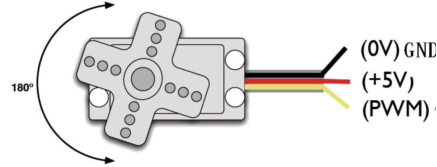

**Working Principle**

The rotation angle of servo motor is controlled by regulating the duty cycle of PWM (Pulse-Width Modulation) signal. The standard cycle of PWM signal is 20ms (50Hz). Theoretically, the width is distributed between 1ms-2ms, but in fact, it's between 0.5ms-2.5ms. The width corresponds the rotation angle from 0° to 180°. But note that for different brand motors, the same signal may have different rotation angles. 


**Components**


**Connection Diagram**


**Test Code 1**


```c
//**********************************************************************
/*
 * Filename    : Servo_1
 * Description : Steering gear rotation Angle 0-90-180, repeatly
 * Auther      : http//www.keyestudio.com
*/
int servoPin = 4;//steering gear PIN

void setup() {
  pinMode(servoPin, OUTPUT);//steering pin is set to output
}
void loop() {
  servopulse(servoPin, 0);//Rotate it to zero degrees
  delay(1000);//delay 1S
  servopulse(servoPin, 90);//Rotate it to 90 degrees
  delay(1000);
  servopulse(servoPin, 180);//Rotate it to 180 degrees
  delay(1000);
}

void servopulse(int pin, int myangle) { //Impulse function
  int pulsewidth = map(myangle, 0, 180, 500, 2500); //Map Angle to pulse width
  for (int i = 0; i < 10; i++) { //Output a few more pulses
    digitalWrite(pin, HIGH);//Set the steering gear interface level to high
    delayMicroseconds(pulsewidth);//The number of microseconds of delayed pulse width value
    digitalWrite(pin, LOW);//Lower the level of steering gear interface
    delay(20 - pulsewidth / 1000);
  }
}
//**********************************************************************
```


**Code Explanation 1**

**1.** map(value, fromLow, fromHigh, toLow, toHigh)；Value is the value we map. fromLow, fromHigh is the maximum and minimum value；

toLow, toHigh are the upper limit and lower limit we map. For example, map(myangle, 0, 180, 500, 2500) means that an angle value myangle(0°-180°）the mapping range is from 500us to 2500us.

We use the function servopulse() to make the servo move. We also make the servo rotate 0°, 90°and 180°cyclically.

**Test Result 1**

Connect the wires according to the experimental wiring diagram, compile and upload the code to the ESP32. After uploading successfully，we will use a USB cable to power on, the servo will rotate 0°，90° and 180° cyclically.

**Test Code 2**


```c
//**********************************************************************
/*
 * Filename    : Servo Sweep
 * Description : Control the servo motor for sweeping
 * Auther      : http//www.keyestudio.com
*/
#include <ESP32Servo.h>

Servo myservo;  // create servo object to control a servo

int posVal = 0;    // variable to store the servo position
int servoPin = 4; // Servo motor pin

void setup() {
  myservo.setPeriodHertz(50);           // standard 50 hz servo
  myservo.attach(servoPin, 500, 2500);  // attaches the servo on servoPin to the servo object
}
void loop() {

  for (posVal = 0; posVal <= 180; posVal += 1) { // goes from 0 degrees to 180 degrees
    // in steps of 1 degree
    myservo.write(posVal);       // tell servo to go to position in variable 'pos'
    delay(15);                   // waits 15ms for the servo to reach the position
  }
  for (posVal = 180; posVal >= 0; posVal -= 1) { // goes from 180 degrees to 0 degrees
    myservo.write(posVal);       // tell servo to go to position in variable 'pos'
    delay(15);                   // waits 15ms for the servo to reach the position
  }
}
//********************************************************************************
```

**Code Explanation 2**

myservo. write (pos) is the rotation angle to POS.  myservo. read () reads the current angle value of the servo.  

**Test Result 2**

Connect the wires according to the experimental wiring diagram, compile and upload the code to the ESP32. After uploading successfully，we will use a USB cable to power on, the servo will rotate from 0° to 180° by moving 1° for each 15ms.

### Project 22: Ultrasonic Sensor


Bats and some marine animals are able to use high frequencies of sound for echolocation or communication. They can emit ultrasonic waves from the larynx through the mouth or nose and use the sound waves that bounce back to orient and determine the position, size and whether nearby objects are moving.

Ultrasonic is a frequency higher than 20000 Hz sound wave, which has a good direction, a strong penetration ability, and is easy to obtain more concentrated sound energy as well as spread far in the water. It can be used for ranging, speed measurement, cleaning, welding, gravel, sterilization and disinfection. What‘s more, it has many applications in medicine, military, industry and agriculture.

**Overview**

In this kit, there is a keyes HC-SR04 ultrasonic sensor, which can detect obstacles and the detailed distance between the sensor and the obstacle. Its principle is the same as that of bat flying. It can emit the ultrasonic signals that cannot be heard by humans. When these signals hit an obstacle and come back immediately. The distance between the sensor and the obstacle can be calculated by the time gap of emitting signals and receiving signals.

In the experiment, we use the sensor to detect the distance between the sensor and the obstacle, and print the test result.

**Working Principle**

The most common ultrasonic ranging method is the echo detection. As shown below; when the ultrasonic emitter emits the ultrasonic waves towards certain direction, the counter will count. The ultrasonic waves travel and reflect back once encountering the obstacle. Then the counter will stop counting when the receiver receives the ultrasonic waves coming back.

The ultrasonic wave is also sound wave, and its speed of sound V is related to temperature. Generally, it travels 340m/s in the air.
According to time t, we can calculate the distance s from the emitting spot to the obstacle.

s=340t/2.

The HC-SR04 ultrasonic ranging module can provide a non-contact distance sensing function of 2cm-400cm, and the ranging accuracy can reach as high as 3mm; the module includes an ultrasonic transmitter, receiver and control circuit. Basic working principle:

1\. First pull down the TRIG, and then trigger it with at least 10us high level signal;

2\. After triggering, the module will automatically transmit eight 40KHZ square waves, and automatically detect whether there is a signal to return.

3\. If there is a signal returned back, through the ECHO to output a high level, the duration time of high level is actually the time from emission to reception of ultrasonic.

Test distance = high level duration \* 340m/s \* 0.5.


**Components**


**Connection Diagram**


**Test Code**


```c
//**********************************************************************************
/*  
 * Filename    : Ultrasonic
 * Description : Use the ultrasonic module to measure the distance.
 * Auther      : http//www.keyestudio.com
*/
const int TrigPin = 13; // define TrigPin
const int EchoPin = 14; // define EchoPin.
int duration = 0; // Define the initial value of the duration to be 0
int distance = 0;//Define the initial value of the distance to be 0
void setup() 
{
  pinMode(TrigPin , OUTPUT); // set trigPin to output mode
  pinMode(EchoPin , INPUT); // set echoPin to input mode
  Serial.begin(9600);  // Open serial monitor at 9600 baud to see ping results.
}
void loop()
{
 // make trigPin output high level lasting for 10μs to triger HC_SR04 
  digitalWrite(TrigPin , HIGH);
  delayMicroseconds(10);
  digitalWrite(TrigPin , LOW);
  // Wait HC-SR04 returning to the high level and measure out this waitting time
  duration = pulseIn(EchoPin , HIGH);
  // calculate the distance according to the time
  distance = (duration/2) / 28.5 ;
  Serial.print("Distance: ");
  Serial.print(distance); //Serial port print distance value
  Serial.println("cm");
  delay(300); // Wait 100ms between pings (about 20 pings/sec).
}
//**********************************************************************************
```


**Test Result**

Connect the wires according to the experimental wiring diagram, compile and upload the code to the ESP32. After uploading successfully，we will use a USB cable to power on. Open the serial monitor and set baud rate to 9600.

The serial monitor will print the distance between the ultrasonic sensor and the object.


### Project 23: IR Receiver Module


**Overview**

Infrared remote control is currently the most widely used means of communication and remote control, which has the characteristics of small volume, low power consumption, strong function and low cost. Therefore, recorder, audio equipment, air conditioning machine and toys and other small electrical devices have also used the infrared remote control.

Its transmitting circuit is the use of infrared light emitting diode to emit modulated infrared light wave. The circuit is composed of infrared receiving diode, triode or silicon photocell. They convert infrared light emitted by infrared emitter into corresponding electrical signal, and then send back amplifier.    

In this experiment, we need to know how to use the infrared receiving sensor. The infrared receiving sensor mainly uses the VS1838B infrared receiving sensor element. It integrates receiving, amplifying, and demodulating. The internal IC has already completed the demodulation, and the output is a digital signal. It can receive 38KHz modulated remote control signal.

In the experiment, we use the IR receiver to receive the infrared signal emitted by the external infrared transmitting device, and display the received signal in the shell.

**Working Principle**


The main part of the IR remote control system is modulation, transmission and reception. The modulated carrier frequency
is generally between 30khz and 60khz, and most of them use a square wave of 38kHz and a duty ratio of 1/3. A 4.7K pull-up resistor R3 is added to the signal end of the infrared receiver.

**Components**


**Connection Diagram**


**Test Code**


```c
//**********************************************************************************
/*  
 * Filename    : IR Receiver
 * Description : Decode the infrared remote control and print it out through the serial port.
 * Auther      : http//www.keyestudio.com
*/
#include <Arduino.h>
#include <IRremoteESP8266.h>
#include <IRrecv.h>
#include <IRutils.h>

const uint16_t recvPin = 15; // Infrared receiving pin
IRrecv irrecv(recvPin);      // Create a class object used to receive class
decode_results results;       // Create a decoding results class object

void setup() {
  Serial.begin(9600);       // Initialize the serial port and set the baud rate to 9600
  irrecv.enableIRIn();        // Start the receiver
  Serial.print("IRrecvDemo is now running and waiting for IR message on Pin ");
  Serial.println(recvPin);   //print the infrared receiving pin
}

void loop() {
  if (irrecv.decode(&results)) {          // Waiting for decoding
    serialPrintUint64(results.value, HEX);// Print out the decoded results
    Serial.println("");
    irrecv.resume();                      // Release the IRremote. Receive the next value
  }
  delay(1000);
}
//**********************************************************************************
```


**Test Result**

Connect the wires according to the experimental wiring diagram, compile and upload the code to the ESP32. After uploading successfully，we will use a USB cable to power on. Open the serial monitor and set baud rate to 9600.

Find the infrared remote control, pull out the insulating sheet, and press the button at the receiving head of the infrared receiving sensor. After receiving the signal, the LED on the infrared receiving sensor also starts to flash, as shown in the figure below.


Write down the key code value associated with the infrared remote with each key, as you will need this information later. 


### Project 24: DS1307 Clock Module


**Overview**

This module mainly uses the real-time clock chip DS1307, which is the I2C bus interface chip has second, minute, hour, day, month, year and other functions as well as leap year automatic adjustment function introduced by DALLAS. It can work independently of CPU, and won‘t’ affected by the CPU main crystal oscillator and capacitance as well as keep accurate time. What‘s more, monthly cumulative error is generally less than 10 s.

The chip also has a clock protection circuit in case of main power failure and runs on a back-up battery that denies the CPU read and write access. At the same time, it contains automatic switching control circuit of standby power supply, making it guarantees the accuracy of system clock in case of power failure of main power supply and other bad environment.

Going forward, the DS1307 chip internal integration has a certain capacity, with power failure protection characteristics of static RAM, which can be used to save some key data. 

In the experiment, we use the DS1307 clock module to obtain the system time and print the test results.  

**Working Principle**

Serial real-time clock records year, month, day, hour, minute, second and week; AM and PM indicate morning and afternoon respectively; 56 bytes of NVRAM store data; 2-wire serial port; programmable square wave output; power failure detection and automatic switching circuit; battery current is less than 500nA.


Pins description：X1, 32.768kHz crystal terminal;

VBAT:X2：+3V input;

SDA：serial data;

SCL：serial clock;

SQW/OUT：square waves/output drivers

**Components**


**Connection Diagram**


**Test Code**

```c
//**********************************************************************************
/*  
 * Filename    : DS1307 Real Time Clock
 * Description : Read the year/month/day/hour/minute/second/week of DS1307 clock module
 * Auther      : http//www.keyestudio.com
*/
#include <Wire.h>
#include "RtcDS1307.h"  //DS1307 clock module library

RtcDS1307<TwoWire> Rtc(Wire);//i2cport

void setup(){
  Serial.begin(57600);//Set baud rate to 57600
  Rtc.Begin();
  Rtc.SetIsRunning(true);

  Rtc.SetDateTime(RtcDateTime(__DATE__, __TIME__));  
}

void loop(){
  // Print year/month/day/hour/minute/second/week
  Serial.print(Rtc.GetDateTime().Year());
  Serial.print("/");
  Serial.print(Rtc.GetDateTime().Month());
  Serial.print("/");
  Serial.print(Rtc.GetDateTime().Day());
  Serial.print("    ");
  Serial.print(Rtc.GetDateTime().Hour());
  Serial.print(":");
  Serial.print(Rtc.GetDateTime().Minute());
  Serial.print(":");
  Serial.print(Rtc.GetDateTime().Second());
  Serial.print("    ");
  Serial.println(Rtc.GetDateTime().DayOfWeek());
  delay(1000);//Delay 1 second
}
//**********************************************************************************
```


**Code Explanation**

Rtc.GetDateTime(): the obtained current time and date.

**Rtc.Begin();**enable DS1307 real-time clock

**Rtc.SetIsRunning(true);** run the DS1307 real-time clock, if true changes into false, time will stop.

**Rtc.SetDateTime()；**set time

**Rtc.GetDateTime().Year()** return year

**Rtc.GetDateTime().Month()** return month

**Rtc.GetDateTime().Day()**return date

**Rtc.GetDateTime().Hour()**return hour

**Rtc.GetDateTime().Minute()**return minute

**Rtc.GetDateTime().Second()**return second

**Rtc.GetDateTime().DayOfWeek() return week**


**Test Result**

Connect the wires according to the experimental wiring diagram, attach the DS1307 sensor to a battery, compile and upload the code to the ESP32. After uploading successfully，we will use a USB cable to power on. Open the serial monitor and set baud rate to 9600. We can see the displayed year, month, day, hour, minute, second and week on the serial monitor, and set the time and date to refresh every second, as shown below:

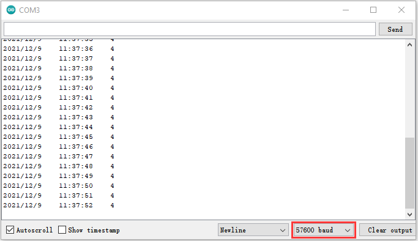

### Project 25: TM1650 4-Digit Tube Display


**Overview**

This module is mainly composed of a 0.36 inch red common anode 4-digit digital tube, and its driver chip is TM1650. When using it, we only need two signal lines to make the single-chip microcomputer control a 4-bitdigit tube, which greatly saves the IO port resources of the control board.

TM1650 is a special circuit for LED (light emitting diode display) drive control. It integrates MCU input and output control digital interface, data latch, LED drivers, keyboard scanning, brightness adjustment and other circuits.

TM1650 has stable performance, reliable quality and strong anti-interference ability, which can be applied to the application of
long-term continuous working for 24 hours.

TM1650 uses 2-wire serial transmission protocol for communication (note that this data transmission protocol is not a standard I2C protocol). The chip can drive the digital tube and save MCU pin resources through two pins and MCU communication.

**Working Principle**

TM1650 adopts IIC treaty, which uses DIO and CLK buses.


**Data command setting**: 0x48 means that we light up the digital tube, instead of enable the function of key scanning

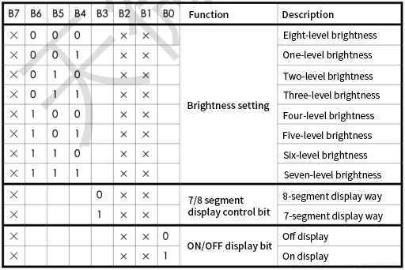

**Command display setting:**

bit\[6:4\]: set the brightness of tube display, and 000 is brightest

bit\[3\]: set to show decimal points

bit\[0\]: start the display of the tube display

**Components**


**Connection Diagram**


**Test Code**


```c
//**********************************************************************************
/*  
 * Filename    : TM1650 Four digital tube
 * Description : TM1650 Four Digital Tube shows 0-9999
 * Auther      : http//www.keyestudio.com
*/
#include "TM1650.h"
#define CLK 22    //pins definitions for TM1650 and can be changed to other ports       
#define DIO 21
TM1650 DigitalTube(CLK,DIO);

void setup(){
  DigitalTube.setBrightness();  //set brightness, 0---7, default : 2
  DigitalTube.displayOnOFF();   //display on or off, 0=display off, 1=display on, default : 1
  for(char b=1;b<5;b++){
    DigitalTube.clearBit(b);      //DigitalTube.clearBit(0 to 3); Clear bit display.
  }
  // DigitalTube.displayDot(1,true); //Bit0 display dot. Use before displayBit().
  DigitalTube.displayBit(1,0);    //DigitalTube.Display(bit,number); bit=0---3  number=0---9
}

void loop(){
  for(int num=0; num<10000; num++){
    displayFloatNum(num);
    delay(100);
  }
}

void displayFloatNum(float num){
  if(num > 9999)
    return;
  int dat = num*10;
   //DigitalTube.displayDot(2,true); //Bit0 display dot. Use before displayBit().
  if(dat/10000 != 0){
    DigitalTube.displayBit(1, dat%100000/10000);  
    DigitalTube.displayBit(2, dat%10000/1000);
    DigitalTube.displayBit(3, dat%1000/100);
    DigitalTube.displayBit(4, dat%100/10);
    return;
  }
  if(dat%10000/1000 != 0){
    DigitalTube.clearBit(1); 
    DigitalTube.displayBit(2, dat%10000/1000); 
    DigitalTube.displayBit(3, dat%1000/100);
    DigitalTube.displayBit(4, dat%100/10);
    return;
  }
  if(dat%1000/100 != 0){
  DigitalTube.clearBit(1); 
  DigitalTube.clearBit(2);
  DigitalTube.displayBit(3, dat%1000/100);
  DigitalTube.displayBit(4, dat%100/10);  
  return;
}
  DigitalTube.clearBit(1); 
  DigitalTube.clearBit(2);
  DigitalTube.clearBit(3);
  DigitalTube.displayBit(4, dat%100/10);
}
//**********************************************************************************
```


**Test Result**

Connect the wires according to the experimental wiring diagram, compile and upload the code to the ESP32. After uploading successfully，we will use a USB cable to power on. The 4-digit tube display will show integer from 0 to 99999, add 1 for each 10ms. Increase to 9999 then start from 0.

### Project 26: HT16K33\_8X8 Dot Matrix Module


**Overview**

What is the dot matrix display?

The 8X8 dot matrix is composed of 64 light-emitting diodes, and each light-emitting diode is placed at the intersection of the row line and the column line. When the corresponding row is set to 1 level, and a certain column is set to 0 level, the corresponding diode will light up.

**Working Principle**

As the schematic diagram shown, to light up the LED at the first row and column, we only need to set C1 to high level and R1 to low level. To turn on LEDs at the first row, we set R1 to low level and C1-C8 to high level. 16 IO ports are needed, which will highly waste the MCU resources.

Therefore, we designed this module, using the HT16K33 chip to drive an 8\*8 dot matrix, which greatly saves the resources of the single-chip microcomputer.


There are three DIP switches on the module, all of which are set to I2C communication address. The setting method is shown below. A0，A1 and A2 are grounded, that is, the address is 0x70.

<table class="colwidths-auto docutils align-default">
<tbody>
<tr class="odd">
<td>A0（1）</td>
<td>A1（2）</td>
<td>A2（3）</td>
<td>A0（1）</td>
<td>A1（2）</td>
<td>A2（3）</td>
<td>A0（1）</td>
<td>A1（2）</td>
<td>A2（3）</td>
</tr>
<tr class="even">
<td>0（OFF）</td>
<td>0（OFF）</td>
<td>0（OFF）</td>
<td>1（ON）</td>
<td>0（OFF）</td>
<td>0（OFF）</td>
<td>0（OFF）</td>
<td>1（ON）</td>
<td>0（OFF）</td>
</tr>
<tr class="odd">
<td>OX70</td>
<td>OX71</td>
<td>OX72</td>
<td></td>
<td></td>
<td></td>
<td></td>
<td></td>
<td></td>
</tr>
<tr class="even">
<td>A0（1）</td>
<td>A1（2）</td>
<td>A2（3）</td>
<td>A0（1）</td>
<td>A1（2）</td>
<td>A2（3）</td>
<td>A0（1）</td>
<td>A1（2）</td>
<td>A2（3）</td>
</tr>
<tr class="odd">
<td>1（ON）</td>
<td>1（ON）</td>
<td>0（OFF）</td>
<td>0（OFF）</td>
<td>0（OFF）</td>
<td>1（ON）</td>
<td>1（ON）</td>
<td>0（OFF）</td>
<td>1（ON）</td>
</tr>
<tr class="even">
<td>OX73</td>
<td>OX74</td>
<td>OX75</td>
<td></td>
<td></td>
<td></td>
<td></td>
<td></td>
<td></td>
</tr>
<tr class="odd">
<td>A0（1）</td>
<td>A1（2）</td>
<td>A2（3）</td>
<td>A0（1）</td>
<td>A1（2）</td>
<td>A2（3）</td>
<td></td>
<td></td>
<td></td>
</tr>
<tr class="even">
<td>0（OFF）</td>
<td>1（ON）</td>
<td>1（ON）</td>
<td>1（ON）</td>
<td>1（ON）</td>
<td>1（ON）</td>
<td></td>
<td></td>
<td></td>
</tr>
<tr class="odd">
<td>OX76</td>
<td>OX77</td>
<td></td>
<td></td>
<td></td>
<td></td>
<td></td>
<td></td>
<td></td>
</tr>
</tbody>
</table>

**Components**


**Connection Diagram**


**Test Code**


```c
//**********************************************************************************
/*
 * Filename    : 8×8 Dot-matrix Display
 * Description : 8x8 LED dot matrix display“Heart” pattern.
 * Auther      : http//www.keyestudio.com
*/
#include "HT16K33_Lib_For_ESP32.h"

#define SDA 21
#define SCL 22

ESP32_HT16K33 matrix = ESP32_HT16K33();

//The brightness values can be set from 1 to 15, with 1 darkest and 15 brightest
#define  A  15

byte result[8][8];
byte test1[8] = {0x00,0x42,0x41,0x09,0x09,0x41,0x42,0x00};

void setup()
{
  matrix.init(0x70, SDA, SCL);//Initialize matrix
  matrix.showLedMatrix(test1,0,0);
  matrix.show();
}

void loop()
{
  for (int i = 0; i <= 7; i++)
  {
    matrix.setBrightness(i);
    delay(100);
  }
  for (int i = 7; i > 0; i--)
  {
    matrix.setBrightness(i);
    delay(100);
  }
}
//**********************************************************************************
```

**Code Explanation**

First we need to import the library file.

The pattern in our code is an array of byte data type, which is shown in the table below. We convert  into binary, and fill in the 8\*8 form below to make it clear. 1 means on, 0 means off. Then we can see that it is a smile shape.


**Test Result**

Connect the wires according to the experimental wiring diagram, compile and upload the code to the ESP32. After uploading successfully，we will use a USB cable to power on. Then the dot matrix displays a “ smile ”pattern.

## Comprehensive Experiments

The previous projects are related to single sensor or module. In the following part, we will combine various sensors and modules to create some comprehensive experiments to perform special functions.

### Project 27: Button-controlled LED

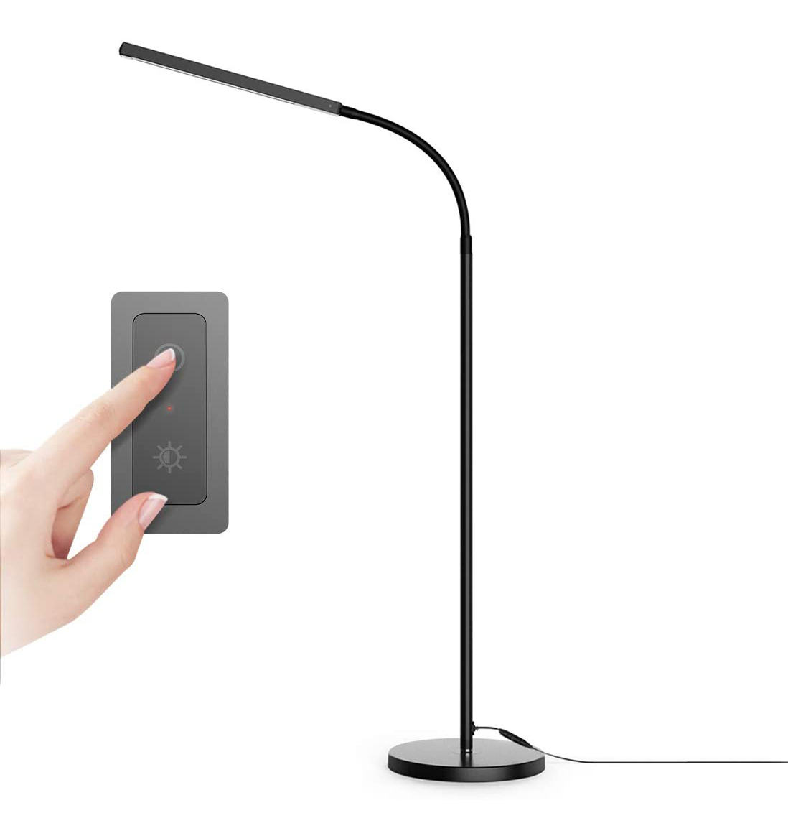

**Overview**

In this lesson, we will make an extension experiment with a button and an LED. When the button is pressed and low levels are output, the LED will light up; when the button is released, the LED will go off. Then we can control a module with another module.

**Components**


### **Connection Diagram**


**Test Code**


```c
//**********************************************************************
/* 
 * Filename    : button_control_LED
 * Description : Make a table lamp.
 * Auther      : http//www.keyestudio.com
*/
#define PIN_LED    4
#define PIN_BUTTON 15
bool ledState = false;

void setup() {
  // initialize digital pin PIN_LED as an output.
  pinMode(PIN_LED, OUTPUT);
  pinMode(PIN_BUTTON, INPUT);
}

// the loop function runs over and over again forever
void loop() {
  if (digitalRead(PIN_BUTTON) == LOW) {
    delay(20);
    if (digitalRead(PIN_BUTTON) == LOW) {
      reverseGPIO(PIN_LED);
    }
    while (digitalRead(PIN_BUTTON) == LOW);
  }
}

void reverseGPIO(int pin) {
  ledState = !ledState;
  digitalWrite(pin, ledState);
}
//**********************************************************************
```

**Test Result**

Connect the wires according to the experimental wiring diagram, compile and upload the code to the ESP32. After uploading successfully，we will use a USB cable to power on. When the button is pressed, the LED will light up; when pressed again, the LED will go off.

### Project 28: Alarm Experiment


**Overview**

In the previous experiment, we control an output module though an input module. In this lesson, we will make an experiment that the active buzzer will emit sounds once an obstacle appears.

**Components**


**Connection Diagram**


**Test Code**

```c
//**********************************************************************************
/*  
 * Filename    : Avoiding alarm
 * Description : Obstacle avoidance sensor controls the buzzer
 * Auther      : http//www.keyestudio.com
*/
int item = 0;
void setup() {
  pinMode(15, INPUT);  //Obstacle avoidance sensor is connected to GPIO15 and set to input mode
  pinMode(4, OUTPUT); //The buzzer is connected to GPIO4 and set to output mode
}

void loop() {
  item = digitalRead(15);//Read the level value output by the obstacle avoidance sensor
  if (item == 0) {//Obstruction detected
    digitalWrite(4, HIGH);//The buzzer sounded
  } else {//No obstacles detected
    digitalWrite(4, LOW);//The buzzer is off
  }
  delay(100);//Delay 100ms
}
//**********************************************************************************
```

**Code Explanation**

Set IO ports according to connection diagram then configure pins mode.

The value is 0 when pressing the button, So, we can determine the key value(0）through if (item == 0) and make the buzzer beep digitalWrite(4, HIGH).

**Test Result**

Connect the wires according to the experimental wiring diagram, compile and upload the code to the ESP32. After uploading successfully，we will use a USB cable to power on. If the obstacle is detected, the active buzzer will chime; if not, it won’t beep.


### Project 29: Intrusion Detection


**Description**

In this experiment, we use a PIR motion sensor to control an active buzzer to emit sounds and the onboard LED to flash rapidly.

**Required Components**


**Connection Diagram**


**Test Code**

```c
//**********************************************************************************
/*  
 * Filename    : PIR alarm
 * Description : PIR control buzzer
 * Auther      : http//www.keyestudio.com
*/
int item = 0;
void setup() {
  pinMode(15, INPUT);  //PIR motion sensor is connected to GPIO15 and set as the input mode
  pinMode(4, OUTPUT);//The active buzzer is connected to GPIO4 and set to output mode
  pinMode(22, OUTPUT);//LED is connected to GPIO22 and set to output mode
}

void loop() {
  item = digitalRead(15);//Read digital level signal output by infrared pyrorelease sensor
  if (item == 1) {  //Movement detected
    digitalWrite(4, HIGH); //Turn on the buzzer
    digitalWrite(22, HIGH); //Turn on the LED
    delay(200);//Delay 200ms
    digitalWrite(4, LOW); //Turn off the buzzer
    digitalWrite(22, LOW); //Turn off the LED
    delay(200);//Delay 200ms
  } else {  //No detection
    digitalWrite(4, LOW); //Turn off the buzzer
    digitalWrite(22, LOW); //Turn off the LED
  }
}
//**********************************************************************************
```


**Test Result**

Connect the wires according to the experimental wiring diagram, compile and upload the code to the ESP32. After uploading successfully，we will use a USB cable to power on. If the sensor detects people moving, the buzzer will emit an alarm , and the LED will flash continuously.

### Project 30: Rotary Encoder control RGB


**Introduction**

In this lesson, we will control the LED on the RGB module to show different colors through a rotary encoder.

When designing the code, we need to divide the obtained values by 3 to get the remainders. The remainder is 0 and the LED will become red. The remainder is 1, the LED will become green. The remainder is 2, the LED will turn blue.

**Components**


**Connection Diagram**


**Test Code**

```c
//**********************************************************************************
/*  
 * Filename    : Encoder control RGB
 * Description : Rotary encoder controls RGB to present different effects
 * Auther      : http//www.keyestudio.com
*/
//Interfacing Rotary Encoder with Arduino
//Encoder Switch -> pin 27
//Encoder DT -> pin 14
//Encoder CLK -> pin 12
int Encoder_DT  = 14;
int Encoder_CLK  = 12;
int Encoder_Switch = 27;

int Previous_Output;
int Encoder_Count;

int ledPins[] = {0, 2, 15};    //define red, green, blue led pins
const byte chns[] = {0, 1, 2};        //define the pwm channels
int red, green, blue;

int val;
void setup() {
  Serial.begin(9600);

  //pin Mode declaration
  pinMode (Encoder_DT, INPUT);
  pinMode (Encoder_CLK, INPUT);
  pinMode (Encoder_Switch, INPUT);

  Previous_Output = digitalRead(Encoder_DT); //Read the inital value of Output A
  for (int i = 0; i < 3; i++) {   //setup the pwm channels,1KHz,8bit
    ledcSetup(chns[i], 1000, 8);
    ledcAttachPin(ledPins[i], chns[i]);
   }
}

void loop() {
  //aVal = digitalRead(pinA);

  if (digitalRead(Encoder_DT) != Previous_Output)
  {
    if (digitalRead(Encoder_CLK) != Previous_Output)
    {
      Encoder_Count ++;
      Serial.print(Encoder_Count);
      Serial.print("  ");
      val = Encoder_Count % 3;
      Serial.println(val);
    }
    else
    {
      Encoder_Count--;
      Serial.print(Encoder_Count);
      Serial.print("  ");
      val = Encoder_Count % 3;
      Serial.println(val);
    }
  }

  Previous_Output = digitalRead(Encoder_DT);

  if (digitalRead(Encoder_Switch) == 0)
  {
    delay(5);
    if (digitalRead(Encoder_Switch) == 0) {
      Serial.println("Switch pressed");
      while (digitalRead(Encoder_Switch) == 0);
    }
  }
  if (val == 0) {
    //RED(255, 0, 0)
    ledcWrite(chns[0], 255 ); 
    ledcWrite(chns[1], 0);
    ledcWrite(chns[2], 0);
  } else if (val == 1) {
    //GREEN(0, 255, 0)
    ledcWrite(chns[0], 0); 
    ledcWrite(chns[1], 255);
    ledcWrite(chns[2], 0);
  } else {
    //BLUE(0, 0, 255)
    ledcWrite(chns[0], 0); 
    ledcWrite(chns[1], 0);
    ledcWrite(chns[2], 255);
  }
}
//**********************************************************************************
```


**Code Explanation**


1.  In the experiment, we set the val to the remainder of Encoder\_Count divided by 3. Encoder\_Count is the value of the encoder. Then we can set pin GPIO0 (red), GPIO2 (green) and GPIO15 (blue) according to remainders.
    
    2\. Referring to the control method learned in the previous experiment, use the LED on the remainder control module to display the corresponding light color. The value obtained by taking the remainder of 3 for any number is 0 or 1 or 2. We use these three values to judge, and display the corresponding color.


**Test Result**

Connect the wires according to the experimental wiring diagram, compile and upload the code to the ESP32. After uploading successfully, we will use a USB cable to power on. Open the serial monitor and set the baud rate to 9600, then rotate the knob of the rotary encoder to display the reminders, which can control colors of LED(red green blue).


### Project 31: Rotary Potentiometer


**Introduction**

In the previous courses, we did experiments of breathing light and controlling LED with button. In this course, we do these two experiments by controlling the brightness of LED through an adjustable potentiometer. The brightness of LED is controlled by PWM values, and the range of analog values is 0 to 4095 and the PWM value range is 0-255.

After the code is set successfully, we can control the brightness of the LED on the module by rotating the potentiometer.

**Required Components**


**Connection Diagram**


**Test Code**


```c
//**********************************************************************************
/*  
 * Filename    : adjust the light
 * Description : Controlling the brightness of LED by potentiometer.
 * Auther      : http//www.keyestudio.com
*/
#define PIN_ANALOG_IN    34  //the pin of the potentiometer
#define PIN_LED     15  // the pin of the LED
#define CHAN            0
void setup() {
  ledcSetup(CHAN, 1000, 12);
  ledcAttachPin(PIN_LED, CHAN);
}

void loop() {
  int adcVal = analogRead(PIN_ANALOG_IN); //read adc
  int pwmVal = adcVal;        // adcVal re-map to pwmVal
  ledcWrite(CHAN, pwmVal);    // set the pulse width.
  delay(10);
}
//**********************************************************************************
```

**Code Explanation**

In the experiment, the mapping function maps adcVal from the range of 0-4095 to 0-255, and assigns it to pwmVal.

**Test Result**

Connect the wires according to the experimental wiring diagram, compile and upload the code to the ESP32. After uploading successfully，we will use a USB cable to power on. Rotating the potentiometer on the module can adjust the brightness of the LED on the LED module.

### Project 32: Sound Activated Light


**Introduction**

In this lesson, we will make a smart sound activated light using a sound sensor and an LED module. When we make a sound, the light will automatically turn on; when there is no sound, the light will automatically turn off. How it works? Because the sound-controlled light is equipped with a sound sensor, and this sensor converts the intensity of external sound into a corresponding value. Then set a threshold, when the threshold is exceeded, the light will will go out, and when it is not exceeded, the light will turn on.

**Components**


**Connection Diagram**


**Test Code**


```c
//**********************************************************************************
/*  
 * Filename    : sound-controlled lights
 * Description : Sound sensor controls LED on and off
 * Auther      : http//www.keyestudio.com
*/
int ledPin = 15;//LED is connected to GP15
int microPin = 34;//Sound sensor is connected to GPIO34
void setup() {
  Serial.begin(9600);//Set baud rate to 9600
  pinMode(ledPin, OUTPUT);//LED is the output mode
}

void loop() {
  int val = analogRead(microPin);//Read analog value
  Serial.print(val);// Serial port print
  if(val > 600){//exceed the threshold value
    digitalWrite(ledPin, HIGH);//Lighting LED 3s，and print the corresponding information
    Serial.println("  led on");
    delay(3000);
  }else{//otherwise
    digitalWrite(ledPin, LOW);//Turn off the LED and print the corresponding information
    Serial.println("  led off");
  }
  delay(100);
}
//**********************************************************************************
```

**Code Explanation**

We set the ADC threshold value to 600. If more than 600, LED will be on 3s; on the contrary, it will be off.

**Test Result**

Connect the wires according to the experimental wiring diagram, compile and upload the code to the ESP32. After uploading successfully，we will use a USB cable to power on. Open the serial monitor and set the baud rate to 9600, then the corresponding volume ADC value will be displayed.

When the analog value of sound is greater than 600, the LED on the LED module will light up, otherwise it will go off.

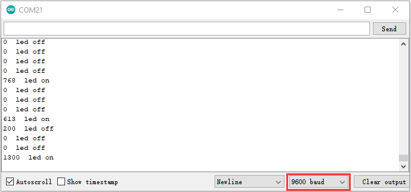

### **Project 33: Ultrasonic Radar**


**Description**

We know that bats use echoes to determine the direction and the location of their preys. In real life, sonar is used to detect sounds in the water. Since the attenuation rate of electromagnetic waves in water is very high, it cannot be used to detect signals, however, the attenuation rate of sound waves in the water is much smaller, so sound waves are most commonly used underwater for observation and measurement.

In this experiment, we will use a speaker module, an RGB module and a 4-digit tube display to make a device for detection through ultrasonic.

**Required Components**


**Connection Diagram**


**Test Code**


```c
//**********************************************************************************
/*  
 * Filename    : Ultrasonic radar
 * Description : Ultrasonic control four digit tube, buzzer and RGB analog ultrasonic radar.
 * Auther      : http//www.keyestudio.com
*/
#include "TM1650.h" //Import the TM1650 library file
//the interfaces are GPIO21 and GPIO22
#define DIO 21
#define CLK 22
TM1650 DigitalTube(CLK,DIO);

int beeppin = 18; //Define the horn pin as GPIO18

int TrigPin = 13; //Set the Trig pin to GPIO13
int EchoPin = 14; //Set the Echo pin to GPIO14
int distance;//Distance measured by ultrasound

int ledPins[] = {0, 2, 15};    //define red, green, blue led pins
const byte chns[] = {0, 1, 2};        //define the pwm channels

float checkdistance() { //get distance
  // A short low level is given beforehand to ensure a clean high pulse:
  digitalWrite(TrigPin, LOW);
  delayMicroseconds(2);
  // The sensor is triggered by a high pulse of 10 microseconds or more
  digitalWrite(TrigPin, HIGH);
  delayMicroseconds(10);
  digitalWrite(TrigPin, LOW);
  // Read the signal from the sensor: a high level pulse，
  //Its duration is the time (in microseconds) from sending the ping command to receiving the echo from the object。
  float distance = pulseIn(EchoPin, HIGH) / 58.00;  //Convert to distance
  delay(10);
  return distance;
}

void setup() {
  DigitalTube.setBrightness();  //set brightness, 0---7, default : 2
  DigitalTube.displayOnOFF();   //display on or off, 0=display off, 1=display on, default : 1
  for(char b=1;b<5;b++){
    DigitalTube.clearBit(b);      //DigitalTube.clearBit(0 to 3); Clear bit display.
  }
  // DigitalTube.displayDot(1,true); //Bit0 display dot. Use before displayBit().
  DigitalTube.displayBit(1,0);    //DigitalTube.Display(bit,number); bit=0---3  number=0---9
  pinMode(TrigPin, OUTPUT);//Sets the Trig pin as output
  pinMode(EchoPin, INPUT);  //Set the Echo pin as input
  ledcSetup(3, 1000, 8);//setup the pwm channels,1KHz,8bit
  ledcAttachPin(18, 3);
  for (int i = 0; i < 3; i++) {   //setup the pwm channels,1KHz,8bit
    ledcSetup(chns[i], 1000, 8);
    ledcAttachPin(ledPins[i], chns[i]);
  }
}

void loop() {
  distance = checkdistance(); //Ultrasonic ranging
  displayFloatNum(distance);  //Nixie tube shows distance
  if (distance <= 10) {
    ledcWrite(3, 100);
    delay(100);
    ledcWrite(3, 0);
    ledcWrite(chns[0], 255); //Common cathode LED, high level to turn on the led.
    ledcWrite(chns[1], 0);
    ledcWrite(chns[2], 0);

  } else if (distance > 10 && distance <= 20) {
    ledcWrite(3, 200);
    delay(200);
    ledcWrite(3, 150);
    ledcWrite(chns[0], 0); 
    ledcWrite(chns[1], 255);
    ledcWrite(chns[2], 0);
  } else {
    ledcWrite(3, 0);
    ledcWrite(chns[0], 0);
    ledcWrite(chns[1], 0);
    ledcWrite(chns[2], 255);
  }
}

void displayFloatNum(float distance){
  if(distance > 9999)
    return;
  int dat = distance*10;
   //DigitalTube.displayDot(2,true); //Bit0 display dot. Use before displayBit().
  if(dat/10000 != 0){
    DigitalTube.displayBit(1, dat%100000/10000);  
    DigitalTube.displayBit(2, dat%10000/1000);
    DigitalTube.displayBit(3, dat%1000/100);
    DigitalTube.displayBit(4, dat%100/10);
    return;
  }
  if(dat%10000/1000 != 0){
    DigitalTube.clearBit(1); 
    DigitalTube.displayBit(2, dat%10000/1000); 
    DigitalTube.displayBit(3, dat%1000/100);
    DigitalTube.displayBit(4, dat%100/10);
    return;
  }
  if(dat%1000/100 != 0){
  DigitalTube.clearBit(1); 
  DigitalTube.clearBit(2);
  DigitalTube.displayBit(3, dat%1000/100);
  DigitalTube.displayBit(4, dat%100/10);  
  return;
}
  DigitalTube.clearBit(1); 
  DigitalTube.clearBit(2);
  DigitalTube.clearBit(3);
  DigitalTube.displayBit(4, dat%100/10);
}
//**********************************************************************************
```


**Code Explanation**

We set sound frequency and light color by adjusting different distance range.

We can adjust the distance range in the code.

**Test Result**

Connect the wires according to the experimental wiring diagram, compile and upload the code to the ESP32. After uploading successfully，we will use a USB cable to power on. When the ultrasonic sensor detects different distances, the buzzer will produce different frequencies of sound, the RGB will show different colors, and the measured distances are displayed on the 4-digit tube display.

### Project 34: IR Remote Control


**Introduction**

In the previous experiments, we learned to turn on or turn off the LED, adjust the brightness of a light through PWM, and how to use the infrared receiver module. So in this experiment, we use an infrared remote control to control an LED module.

When we receive a value, we set the PWM value by the corresponding button value, thus you can adjust the brightness. Control the LED to turn on or turn off is in the same way. If we want to use the same button to control the LED to turn on or turn off, we can achieve it through the code.

**Components**


**Connection Diagram**


**Test Code**


```c
//**********************************************************************************
/*  
 * Filename    : IR Control LED
 * Description : Remote controls LED on and off
 * Auther      : http//www.keyestudio.com
*/
#include <Arduino.h>
#include <IRremoteESP8266.h>
#include <IRrecv.h>
#include <IRutils.h>

const uint16_t recvPin = 15; // Infrared receiving pin 15
IRrecv irrecv(recvPin);      // Create a class object used to receive class
decode_results results;       // Create a decoding results class object
int led = 4;//LED connect to GP4

void setup() {
  Serial.begin(9600);
  irrecv.enableIRIn();                  // Start the receiver
  pinMode(led, OUTPUT);
}
////////////////////
void loop() {
  if(irrecv.decode(&results)) {        // Waiting for decoding
    serialPrintUint64(results.value, HEX);// Print out the decoded results
    Serial.print("");
    handleControl(results.value);       // Handle the commands from remote control
    irrecv.resume();                    // Receive the next value
  }
}
  void handleControl(unsigned long value) {
    if (value == 0xFF6897) // Receive the number '1'
     {
       digitalWrite(led, HIGH);//turn on LED
       Serial.println("  led on");
     } 
    else if (value == 0xFF9867) // Receive the number '2'
     {
        digitalWrite(led, LOW);//turn off LED
       Serial.println("  led off"); 
    }
}
//**********************************************************************************
```


**Test Result**

Connect the wires according to the experimental wiring diagram, compile and upload the code to the ESP32. After uploading successfully，we will use a USB cable to power on. Open the serial monitor and set the baud rate to 9600. Press the button 1 of the remote, which will be displayed on the monitor, and the LED will be on. Similarly, press the button 2 , the LED will be off.


### Project 35：Bluetooth

This chapter mainly introduces how to use the bluetooth of ESP32 for simple data transmission with mobile phone. Experiment 35.1 is conventional bluetooth, and experiment 35.2 is bluetooth control LED.

#### Project 35.1：Classic Bluetooth

**Components**

|  |  |
| ------------------------------------------------------------ | ------------------------------------------------------------ |
| Micro USB Cable*1                                            | ESP32*1                                                      |

In this project, we need to use a bluetooth dobbed serial bluetooth terminal for a study. If you haven’t install it, please click the
installation: <https://www.appsapk.com/serial-bluetooth-terminal/> .

Here is its sign


**Component Knowledge**

Bluetooth is a short-distance communication system that can be divided into two types, namely low power bluetooth (BLE) and classic bluetooth. There are two modes for simple data transfer: master mode and slave mode. 

**Master Mode**: In this mode, work is done on the master device and can be connected to the slave device. When the device initiates a connection request in the main mode, information such as the address and pairing password of other bluetooth devices are required.  Once paired, you can connect directly to them.  

**Slave Mode**: A bluetooth module in the slave mode can only accept connection requests from the host, but cannot initiate connection requests. After being connected to a host device, it can send and receive data through the host device. Bluetooth devices can interact with each other, when they interact, the bluetooth device in the main mode searches for nearby devices. While a connection is established, they can exchange data. For example, when a mobile phone exchanges data with ESP32, the mobile phone is usually in master mode and the ESP32 is in slave mode.  

​             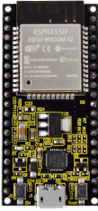

​       master mode                slave mode

**Wiring Diagram**

We can use a USB cable to connect ESP32 mainboard to the USB port on a computer.

      


**Test Code**


```c
//**********************************************************************************
/*
 * Filename    : Classic Bluetooth--SerialToSerialBT
 * Description : ESP32 communicates with the phone by bluetooth and print phone's data via a serial port
 * Auther      : http//www.keyestudio.com
*/
#include "BluetoothSerial.h"

BluetoothSerial SerialBT;
String buffer;
void setup() {
  Serial.begin(115200);
  SerialBT.begin("ESP32test"); //Bluetooth device name
  Serial.println("\nThe device started, now you can pair it with bluetooth!");
}

void loop() {
  if (Serial.available()) {
    SerialBT.write(Serial.read());
  }
  if (SerialBT.available()) {
    Serial.write(SerialBT.read());
  }
  delay(20);
}
//**********************************************************************************
```


**Test Result**

Compile and upload the code to the ESP32. After uploading successfully，we will use a USB cable to power on. Open the serial
monitor and set the baud rate to 115200. When you see the serial prints the character, as shown below, it means that the ESP32's bluetooth is waiting for connect ion with a phone. (If open the serial monitor and set the baud rate to 115200, the information is not displayed, please press the RESET button of the ESP32)


Ensure that your mobile phone bluetooth is enabled and the bluetooth application of "Serial Bluetooth Terminal" is installed.  


Click“Search”，search for the nearby bluetooth and select to connect the“ESP32 test”.

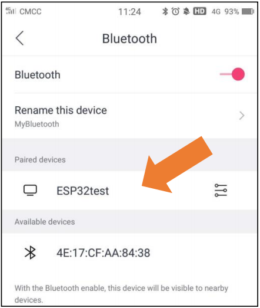

Open the software APP and click the left side of the terminal, select "Devices".


If you select ESP32test in classic bluetooth mode, a successful connection message will appear as shown below.  


Data can be transferred between your phone and a computer via ESP32 now.


Send “Hello！”, When the computer receives it, which will reply with "Hi\!".


#### Project 35.2：Bluetooth Control LED

**Components**


**Wiring Diagram**
    

**Test Code**

```c
//**********************************************************************************
/*
 * Filename    : Bluetooth Control LED
 * Description : The phone controls esp32's led via bluetooth.
                When the phone sends "LED_on," ESP32's LED lights turn on.
                When the phone sends "LED_off," ESP32's LED lights turn off.
 * Auther      : http//www.keyestudio.com
*/
#include "BluetoothSerial.h"
#include "string.h"
#define LED 15
BluetoothSerial SerialBT;
char buffer[20];
static int count = 0;
void setup() {
  pinMode(LED, OUTPUT);
  SerialBT.begin("ESP32test"); //Bluetooth device name
  Serial.begin(115200);
  Serial.println("\nThe device started, now you can pair it with bluetooth!");
}

void loop() {
  while(SerialBT.available())
  {
    buffer[count] = SerialBT.read();
    count++;
  }
  if(count>0){
    Serial.print(buffer);
    if(strncmp(buffer,"led_on",6)==0){
      digitalWrite(LED,HIGH);
    }
    if(strncmp(buffer,"led_off",7)==0){
      digitalWrite(LED,LOW);
    }
    count=0;
    memset(buffer,0,20);
  }
}
//**********************************************************************************
```


**Test Result**

Connect the wires according to the experimental wiring diagram, compile and upload the code to the ESP32. After uploading successfully，we will use a USB cable to power on. The APP operation is the same as the project 35.1. To make the external LED on and off, simply change the sending content to "led\_on" and "led\_off". Moving the APP to send data:


The serial monitor will display as follows:


**LED Circumstance**


**Note:** If the sent content is not "led-on 'or" led-off ", the status of the LED will not change. If the LED is on, it remains on when
irrelevant content is received; Conversely, if the LED is off, it continues to be off when irrelevant content is received.   

### Project 36：WIFI Station Mode

**Description**

ESP32 has three different WiFi modes: Station mode, AP mode and AP+Station mode. All WiFi programming projects must be configured with WiFi running mode before using, otherwise the WiFi cannot be used. In this project, we are going to learn the WiFi Station mode of the ESP32.

**Components**

|  |  |
| ------------------------------------------------------------ | ------------------------------------------------------------ |
| Micro USB Cable*1                                            | ESP32*1                                                      |

**Wiring Diagram**

Plug the ESP32 to the USB port of your PC


**Component Knowledge**

**Station mode：**

When setting Station mode, the ESP32 is taken as a WiFi client. It can connect to the router network and communicate with other devices on the router via a WiFi connection. As shown in the figure below, the PC and the router have been connected. If the ESP32 wants to communicate with the PC, the PC and the router need to be connected.


**Test Code**

Since WiFi names and passwords vary from place to place, thereby users need to enter the correct WiFi names and passwords in the box shown below before the program code runs.  


```c
//**********************************************************************************
/*
 * Filename    : WiFi Station
 * Description : Connect to your router using ESP32
 * Auther      : http//www.keyestudio.com
*/
#include <WiFi.h> //Include the WiFi Library header file of ESP32.

//Enter correct router name and password.
const char *ssid_Router     = "ChinaNet-2.4G-0DF0"; //Enter the router name
const char *password_Router = "ChinaNet@233"; //Enter the router password

void setup(){
  Serial.begin(115200);
  delay(2000);
  Serial.println("Setup start");
  WiFi.begin(ssid_Router, password_Router);//Set ESP32 in Station mode and connect it to your router.
  Serial.println(String("Connecting to ")+ssid_Router);
//Check whether ESP32 has connected to router successfully every 0.5s.  
  while (WiFi.status() != WL_CONNECTED){
    delay(500);
    Serial.print(".");
  }
  Serial.println("\nConnected, IP address: ");
  Serial.println(WiFi.localIP());//Serial monitor prints out the IP address assigned to ESP32.
  Serial.println("Setup End");
}
 
void loop() {
}
//**********************************************************************************
```


**Test Result**

After entering the correct WiFi names and passwords, compile and upload the code to the ESP32. After uploading successfully，we will use a USB cable to power on. Open the serial monitor and set the baud rate to 115200.

When the ESP32 successfully connects to ssid\_WiFi, the serial monitor prints out the IP address, then monitor will display as follows: (If open the serial monitor and set the baud rate to 115200, the information is not displayed, please press the RESET button of the ESP32)


### Project 37：WIFI AP Mode

**Description**

In this project, we are going to learn the WiFi AP mode of the ESP32.

**Components**

|  |  |
| ------------------------------------------------------------ | ------------------------------------------------------------ |
| Micro USB Cable*1                                            | ESP32*1                                                      |

**Wiring Diagram**

Plug the ESP32 mainboard to the USB port of your PC


**Component Knowledge**

**AP Mode:**

When setting AP mode, a hotspot network will be created, waiting for other WiFi devices to connect. As shown below;

Take the ESP32 as the hotspot, if a phone or PC needs to communicate with the ESP32, it must be connected to the ESP32's hotspot. Communication is only possible after a connection is established via the ESP32.


**Test Code**

Before running the code , you can make any changes to the ESP32 AP name and password in the box as shown below, but in a default circumstance, it doesn’t need to modify.

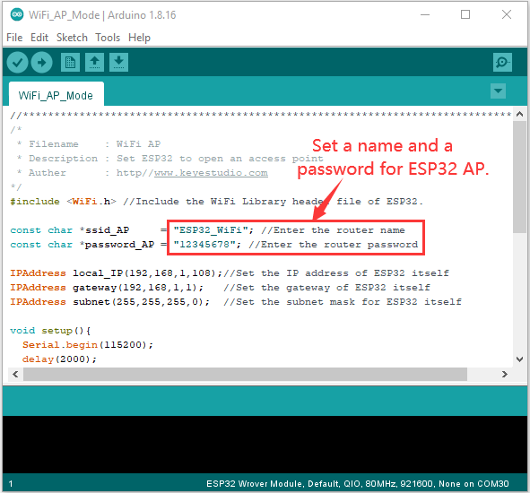


```c
//**********************************************************************************
/*
 * Filename    : WiFi AP
 * Description : Set ESP32 to open an access point
 * Auther      : http//www.keyestudio.com
*/
#include <WiFi.h> //Include the WiFi Library header file of ESP32.

const char *ssid_AP     = "ESP32_WiFi"; //Enter the router name
const char *password_AP = "12345678"; //Enter the router password

IPAddress local_IP(192,168,1,108);//Set the IP address of ESP32 itself
IPAddress gateway(192,168,1,1);   //Set the gateway of ESP32 itself
IPAddress subnet(255,255,255,0);  //Set the subnet mask for ESP32 itself

void setup(){
  Serial.begin(115200);
  delay(2000);
  Serial.println("Setting soft-AP configuration ... ");
  WiFi.disconnect();
  WiFi.mode(WIFI_AP);
  Serial.println(WiFi.softAPConfig(local_IP, gateway, subnet) ? "Ready" : "Failed!");
  Serial.println("Setting soft-AP ... ");
  boolean result = WiFi.softAP(ssid_AP, password_AP);
  if(result){
    Serial.println("Ready");
    Serial.println(String("Soft-AP IP address = ") + WiFi.softAPIP().toString());
    Serial.println(String("MAC address = ") + WiFi.softAPmacAddress().c_str());
  }else{
    Serial.println("Failed!");
  }
  Serial.println("Setup End");
}
 
void loop() {
}
//**********************************************************************************
```


**Test Result**

Compile and upload the code to the ESP32. After uploading successfully，we will use a USB cable to power on. Open the serial
monitor and set the baud rate to 115200, then monitor will display as follows: (If open the serial monitor and set the baud rate to 115200, the information is not displayed, please press the RESET button of the ESP32)


When observing the printed information of the serial monitor, turn on the WiFi scanning function of the mobile phone, you can see the ssid\_AP on ESP32, which is dubbed "ESP32\_Wifi" in this code. You can connect to it either by typing the password "12345678" or by modifying the code to change its AP name and password.  

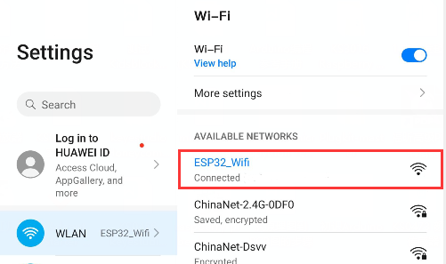

### Project 38：WIFI AP+Station Mode

**Description**

In this project, we are going to learn the AP+Station mode of the ESP32.

**Components**

|  |  |
| ------------------------------------------------------------ | ------------------------------------------------------------ |
| Micro USB Cable*1                                            | ESP32*1                                                      |


**Wiring Diagram**

Plug the ESP32 mainboard to the USB port of your PC

      

**Component Knowledge**

**AP+Station mode:**

 In addition to the AP mode and the Station mode, **AP+Station mode** canbe used at the same time. Turn on the Station mode of the ESP32, connect it to the router network, and it can communicate with the Internet through the router. Then turn on the AP mode to create a hotspot network. Other WiFi devices can be connected to the router network or the hotspot network to communicate with the ESP32.

**Test Code**

Before running the code, you need to modify the ssid\_Router、password\_Router、ssid\_AP and password\_AP, as shown in
the box below:


```c
//**********************************************************************************
/*
 * Filename    : WiFi AP+Station
 * Description : ESP32 connects to the user's router, turning on an access point
 * Auther      : http//www.keyestudio.com
*/
#include <WiFi.h>
 
const char *ssid_Router     =  "ChinaNet-2.4G-0DF0";  //Enter the router name
const char *password_Router =  "ChinaNet@233";  //Enter the router password
const char *ssid_AP         =  "ESP32_WiFi"; //Enter the router name
const char *password_AP     =  "12345678";  //Enter the router password

void setup(){
  Serial.begin(115200);
  Serial.println("Setting soft-AP configuration ... ");
  WiFi.disconnect();
  WiFi.mode(WIFI_AP);
  Serial.println("Setting soft-AP ... ");
  boolean result = WiFi.softAP(ssid_AP, password_AP);
  if(result){
    Serial.println("Ready");
    Serial.println(String("Soft-AP IP address = ") + WiFi.softAPIP().toString());
    Serial.println(String("MAC address = ") + WiFi.softAPmacAddress().c_str());
  }else{
    Serial.println("Failed!");
  }
  
  Serial.println("\nSetting Station configuration ... ");
  WiFi.begin(ssid_Router, password_Router);
  Serial.println(String("Connecting to ")+ ssid_Router);
  while (WiFi.status() != WL_CONNECTED){
    delay(500);
    Serial.print(".");
  }
  Serial.println("\nConnected, IP address: ");
  Serial.println(WiFi.localIP());
  Serial.println("Setup End");
}

void loop() {
}
//**********************************************************************************
```


**Test Result**

Ensure that the code in the program has been modified correctly, compile and upload the code to the ESP32. After uploading successfully，we will use a USB cable to power on. Open the serial monitor and set the baud rate to 115200, then monitor will display as follows: (If open the serial monitor and set the baud rate to 115200, the information is not displayed, please press the RESET button of the ESP32)


Open the WiFi scanning function of the mobile phone, you can see the ssid\_AP.


### Project 39: Comprehensive Experiment


**Introduction**

We did a lot of experiments, and for each one we needed to re-upload the code, so can we achieve different functions through an experiment? In this experiment, we will use an external button module to achieve different functions.

**Components Required**

|          |  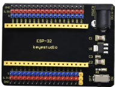              |  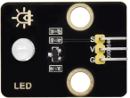     |          |        |
| --------------              | ---------------------              | ---------------------     | ------------------------     | ---------------            |
| ESP32 Board*1               | ESP32 Expansion Board*11           | Purple LED Module*1       |  Button Module*1             | Rotary Potentiometer*1     |
| 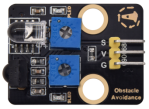        |                |       | 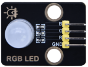         |         |
| Obstacle Avoidance Sensor*1 | Joystick Module*1                  |Ultrasonic sensor *1       | RGB Module *1                | MicroUSB Cable*1           |
| 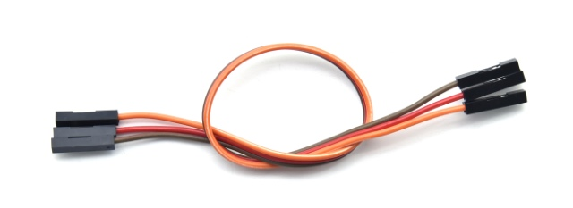       |               |       |                              |                            |
| 3PDupont Wire*4             | 4PDupont Wire*1                    | 5PDupont Wire*1           |                              |                            |


**Wiring Diagram**


**Test Code**


```c
//**********************************************************************
/*
 * Filename    : Comprehensive experiment
 * Description : Multiple sensors/modules work together
 * Auther      : http//www.keyestudio.com
*/
//rgb is connected to 4,0,2
int ledPins[] = {4, 0, 2};    //define red, green, blue led pins
const byte chns[] = {0, 1, 2};        //define the pwm channels
int red, green, blue;

//Rocker module port
int X = 35;
int Y = 34;
int KEY = 32;

//Potentiometer pin is connected to analog port 33
int resPin = 33;

//Obstacle avoidance sensor pin connected to IO port 14
int Avoid = 14;

//LED is Connected to GP5
#define PIN_LED   5  // the pin of the LED
#define CHAN    3

//Ultrasonic sensor port
int Trig = 13;
int Echo = 12;

//Key module port
int button = 23;

int PushCounter = 0;//Store the number of times a key is pressed
int yushu = 0;
unsigned char dht[4] = {0, 0, 0, 0};//Only the first 32 bits of data are received, not the parity bits
bool ir_flag = 1;
float out_X, out_Y, out_Z;

void counter() {
  delay(10);
  ir_flag = 0;
  if (!digitalRead(button)) {
    PushCounter++;
  }
}

void setup() {
  Serial.begin(9600);//Set baud rate to 9600
  pinMode(KEY, INPUT);//Button of remote sensing module
  ledcSetup(CHAN, 1000, 12);
  ledcAttachPin(PIN_LED, CHAN);
  pinMode(button, INPUT);//The key module
  attachInterrupt(digitalPinToInterrupt(button), counter, FALLING);  //External interrupt 0, falling edge fired
  pinMode(Avoid, INPUT);//Obstacle avoidance sensor
  pinMode(Trig, OUTPUT);//Ultrasonic module
  pinMode(Echo, INPUT);
  for (int i = 0; i < 3; i++) {   //setup the pwm channels,1KHz,8bit
    ledcSetup(chns[i], 1000, 8);
    ledcAttachPin(ledPins[i], chns[i]);
  delay(1000);
 }
}

void loop() {
  yushu = PushCounter % 5;
  if (yushu == 0) {  //The remainder is 0
    yushu_0();  //rgb displays
  } else if (yushu == 1) {  //The remainder is 1
    yushu_1();  //Obstacle avoidance sensor detects obstacles
  } else if (yushu == 2) {  //The remainder is 2
    yushu_2();  //Displays the rocker value
  }else if (yushu == 3) {  //The remainder is 3
    yushu_3();  //Display potentiometer ADC value and potentiometer control LED
  } else if (yushu == 4) {  //The remainder is 4
    yushu_4();  //Shows the distance detected by ultrasound
  } 
}

//RGB
void yushu_0() {
  red = random(0, 256);
  green = random(0, 256);
  blue = random(0, 256);
  setColor(red, green, blue);
  delay(200);
}
void setColor(byte r, byte g, byte b) {
  ledcWrite(chns[0], 255 - r); //Common anode LED, low level to turn on the led.
  ledcWrite(chns[1], 255 - g);
  ledcWrite(chns[2], 255 - b);
}

void yushu_1() {
  int val = digitalRead(Avoid);//Read the digital level output by the Obstacle avoidance sensor
  Serial.print(val);//Serial port print value
  if (val == 0) {//Obstruction detected
    Serial.println("   There are obstacles");
  }
  else {//No obstructions detected
    Serial.println("   All going well");
  }
  delay(100);
}

void yushu_2() {
  int x = analogRead(X);
  int y = analogRead(Y);
  int key = digitalRead(KEY);
  Serial.print("X:");
  Serial.print(x);
  Serial.print("    Y:");
  Serial.print(y);
  Serial.print("    KEY:");
  Serial.println(key);
  delay(100);
}

void yushu_3() {
  int adcVal = analogRead(resPin); //read adc
  Serial.println(adcVal);
  int pwmVal = adcVal;        // adcVal re-map to pwmVal
  ledcWrite(CHAN, pwmVal);    // set the pulse width.
  delay(10);
}

void yushu_4() {
  float distance = checkdistance();
  Serial.print("distance:");
  Serial.print(distance);
  Serial.println("cm");
  delay(100);
}

float checkdistance() {
  digitalWrite(Trig, LOW);
  delayMicroseconds(2);
  digitalWrite(Trig, HIGH);
  delayMicroseconds(10);
  digitalWrite(Trig, LOW);
  float distance = pulseIn(Echo, HIGH) / 58.00;
  delay(10);
  return distance;
}
//*************************************************************************************
```


**Code Explanation**

1\. Calculate how many times the button is pressed, divide it by 5, and get the remainder which is 0, 1 2, 3, and 4. According to different remainders, construct five unique functions to control the experiment and realize different functions.

2\. Following the instructions, we can add or remove sensors/modules in the wiring, and then change the experimental function in the code.

**Test Result**

Connect the wires according to the experimental wiring diagram, compile and upload the code to the ESP32. After uploading successfully，we will use a USB cable to power on. At the beginning, the number of the button is 0 and remainder is 0. Open the monitor and set baud rate to 9600.

Press the button, the RGB stops flashing, press once, the remainder is 1.

The function of the project is whether the obstacle avoidance sensor detects obstacles and reads high and low levels. If the sensor does not detect an obstacle, val is 1 and the serial monitor displays "1 All going well" character. When an obstacle is detected, val is 0, and the serial monitor displays "0 There are obstacles" character. The monitor will display as follows:


Note: If you press the button first, the button times will change to 1, and when you open the serial monitor, the program will reset and the button times will change to 0. You need to press the button again to reset the button times.  

Press the button again, the time of pressing buttons is 2 and the remainder is 2. Read digital values at x, y and z axis of the joystick module. As shown below;


Press the key for the third time, the remainder is 3. Then the potentiometer can adjust the PWM value at the GPI05 port to control LED brightness of the purple LED.

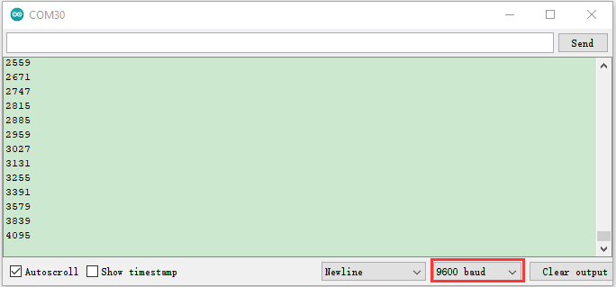

Press the key for the fourth time, the remainder is 4. Then the ultrasonic sensor can detect distance, as shown below;


Press the key for the fifth time, the remainder is 0. Then the RGB will flash. If you press keys incessantly, remainders will change in a loop way. So does functions.


