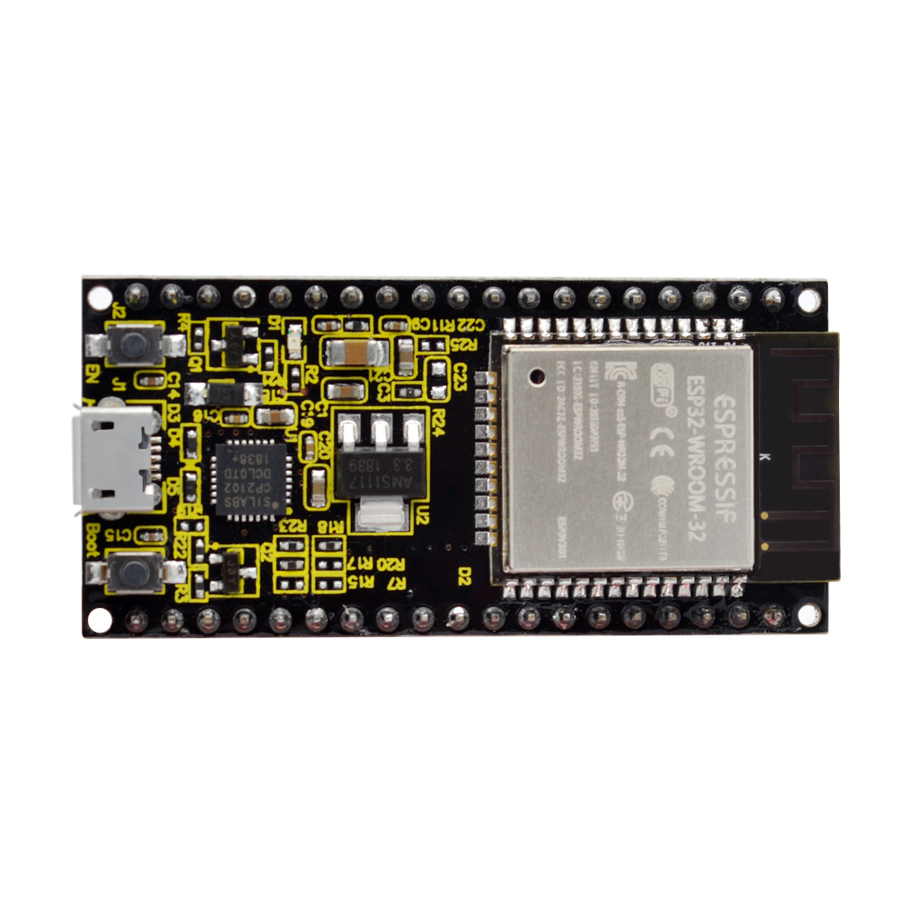
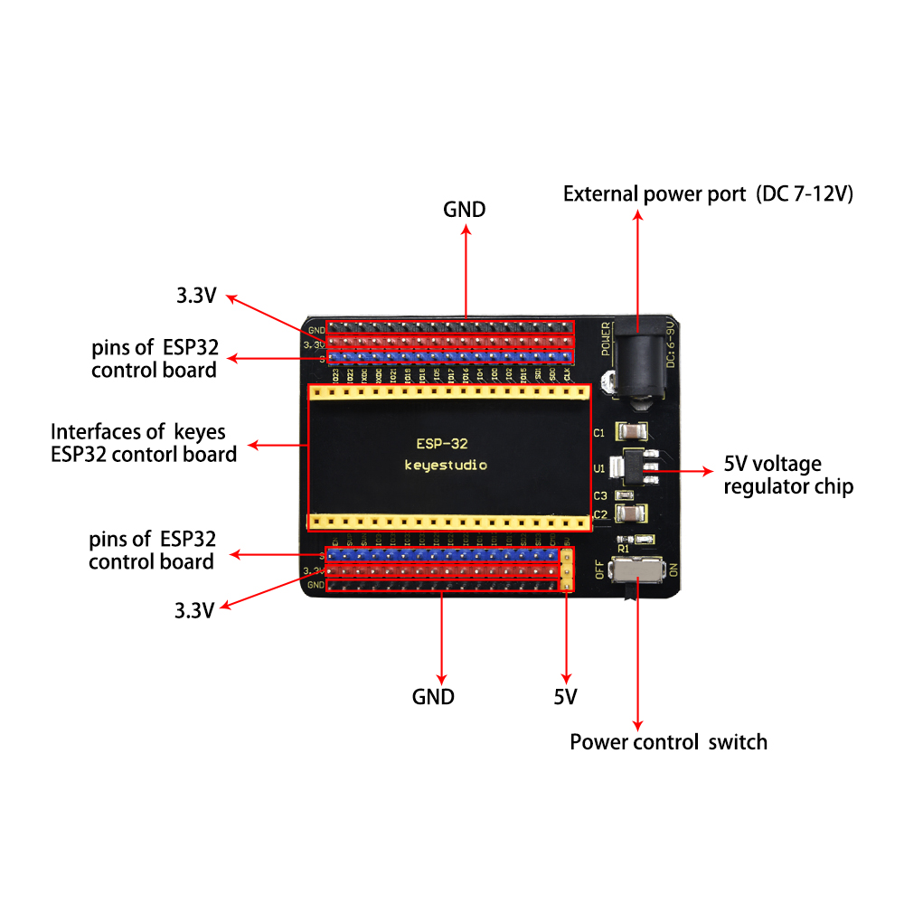

# KS5007(KS5008)Keyestudio ESP32 24 in 1 Sensor Kit

## Description

The Keyestudio ESP32 24 in 1 sensor kit mainly contains 24 commonly used sensors/modules, a ESP32 board, a ESP32 expansion board and Dupont wires.

The 24 sensors and modules are fully compatible with the ESP32 Expansion Board. You only need to stack the ESP32 mainboard onto the ESP32 Expansion Board, and hook up them with Dupont wires, which is simple and convenient.

To make you master the electronic knowledge, detailed tutorials (Arduino C), schematic diagrams, wiring methods and test code are included. Through these projects, you will have a better understanding about programming, logic and electronics.

## Kit

(Note: KS5007 kit includes ESP32 mainboard；KS5008 kit does‘t include the ESP32 mainboard. )

| #    | Picture                                                      | Name                                     | QTY  |
| ---- | ------------------------------------------------------------ | ---------------------------------------- | ---- |
| 1    |  | Keyestudio Purple LED Module             | 1    |
| 2    |  | Keyestudio Common Cathode RGB Module     | 1    |
| 3    |  | Keyestudio Traffic Lights Module         | 1    |
| 4    |  | Keyestudio Active Buzzer                 | 1    |
| 5    |  | Keyestudio 8002b Audio Power Amplifier   | 1    |
| 6    |  | Keyestudio Button Module                 | 1    |
| 7    |  | Keyestudio Tilt Sensor                   | 1    |
| 8    |  | Keyestudio PIR Motion Sensor             | 1    |
| 9    |  | Keyestudio Obstacle Avoidance Sensor     | 1    |
| 10   |  | Keyestudio 6812 RGB Module               | 1    |
| 11   |  | Keyestudio NTC-MF52AT Thermistor         | 1    |
| 12   |  | Keyestudio Photoresistor                 | 1    |
| 13   |  | Keyestudio Sound Sensor                  | 1    |
| 14   |  | KeyestudioRotary Potentiometer           | 1    |
| 15   |  | Keyestudio IR Receiver                   | 1    |
| 16   |  | Keyestudio Reed Switch Sensor            | 1    |
| 17   |  | Keyestudio Rotary Encoder Module         | 1    |
| 18   |  | Keyestudio Joystick Module               | 1    |
| 19   |  | Keyestudio HT16K33 8X8 Dot Matrix Module | 1    |
| 20   |  | Keyestudio TM1650 4-Digit Tube Display   | 1    |
| 21   |  | Keyestudio Thin-film Pressure Sensor     | 1    |
| 22   |  | Keyestudio DS1307 Clock Sensor           | 1    |
| 23   |  | Keyestudio SR01 Ultrasonic Sensor        | 1    |
| 24   |  | Servo                                    | 1    |
| 25   |  | Keyestudio ESP32 Development Board       | 1    |
| 26   |  | Keyestudio ESP32-IO Expansion Board      | 1    |
| 27   |  | Keyestudio IR Remote Control             | 1    |
| 28   |  | USB Cable                                | 1    |
| 29   |  | F-F Dupont Wire                          | 1    |

## Keyestudio ESP32 Core Board

### Introduction

Keyestudio ESP32 Core board is a Mini development board based on the ESP-WROOM-32 module. The board has brought out most I/O ports to pin headers of 2.54mm pitch. These provide an easy way of connecting peripherals according to your own needs.

When it comes to developing and debugging with the development board, the both side standard pin headers can make your operation more simple and handy.

The ESP-WROOM-32 module is the industry's leading integrated WiFi + Bluetooth solution with less than 10 external components. It integrates antenna switches, RF balun, power amplifiers, low noise amplifiers, filters as well as power management modules. At the same time, it also integrates TSMC's low-power 40nm technology, power performance and rf performance, making it safe, reliable and easy to expand to a variety of applications.  

### Specifications

Microcontroller: ESP-WROOM-32Module

USB to Serial Port Chip: CP2102-GMR

Working Voltage: DC 5V

Working Current：80mA（[Average](C:/Users/NINGMEI/AppData/Local/youdao/dict/Application/8.10.7.0/resultui/html/index.html#/javascript:;)）

Current Supply：500mA（[Minimum](C:/Users/NINGMEI/AppData/Local/youdao/dict/Application/8.10.7.0/resultui/html/index.html#/javascript:;)）

Working Temperature Range : -40°C \~ +85°C

WiFi Mode：Station/SoftAP/SoftAP+Station/P2P

WiFi [Protocol](C:/Users/NINGMEI/AppData/Local/youdao/dict/Application/8.10.7.0/resultui/html/index.html#/javascript:;) ：802.11 b/g/n/e/i（802.11n，speed up to 150 Mbps

WiFi Frequency Range：2.4 GHz \~ 2.5 GHz

[Bluetooth](C:/Users/NINGMEI/AppData/Local/youdao/dict/Application/8.10.7.0/resultui/html/index.html#/javascript:;) [Protocol](C:/Users/NINGMEI/AppData/Local/youdao/dict/Application/8.10.7.0/resultui/html/index.html#/javascript:;) ：conform to Bluetooth v4.2 BR/EDR and BLE standard

Dimensions：55\*26\*13mm

Weight：9.3g

### Pin out

ESP32 has fewer pins than commonly used processors, but it doesn't have any problems reusing multiple functions on pins.    
Warning: The pin voltage level of the ESP32 is 3.3V.  If you want to connect the ESP32 to another device with an operating voltage of 5V, you should use a level converter to convert the voltage level.  

**●Power Pins:** The module has two power pins +5V and 3.3V, which can be used to power other devices and modules. 

**● GND Pins：**The module has three grounded pins.  
**● Enable pin (EN) :** This pin is used to enable and disable modules. The pin enables module at high level and disables module at low level.  

**● Input/Output pins (GPIO) :** You can use 32 GPIO pins to communicate with LEDs, switches and other input/output devices. You can also pull these pins up or down internally.  

**Note:** GPIO6 to GPIO11 pins (SCK/CLK, SDO/SD0, SDI/SD1, SHD/SD2, SWP/SD3 and SCS/CMD pins) are used for SPI communication for the internal module, which are not recommended.    
● ADC: You can use the 16 ADC pins on this module to convert analog voltages (the output of some sensors) into digital voltages. Some of these converters are connected to internal amplifiers and are capable of measuring small voltages with high accuracy.

 **● DAC:** ESP32 module has two A/D converters with 8-bit precision.  
**● Touch pad:** The ESP32 module has 10 pins that are sensitive to capacitance changes. You can attach these pins to certain pads (pads on a PCB) and use them as touch switches.   
● SPI:There are two SPI interfaces on the module, which can be used to connect the display screen, SD/microSD memory card module as well as external flash memory, etc.  
● I2C: SDA and SCL pins are used for I2C communication.    
**● Serial Communication (UART) :** There are two UART serial interfaces on this module, which can be used to transfer up to 5Mbps of information between two devices. The UART0 also has CTS and RTS control functions. 

**●PWM:** Almost all ESP32 input/output pins can be used for PWM(pulse-width modulation). Using these pins can control the motors, LED lights and colors, etc.  

4.  **Components**
    
    

## Keyestudio ESP32-IO Expansion Board

### Overview

Keyestudio ESP32-IO Expansion Board is designed to be compatible with the Keyestudio ESP32 Core Board (KS0413), which leads all pin connections of the ESP32 Core Board using a row of pins spaced 2.54mm apart. To facilitate the connection of other sensors, it also has two rows of pins with a spacing of 2.54mm rows, which are used to supply 3.3V DC power for external sensors/modules. 

A power supply circuit is designed on the control board as it seeks to power the Keyestudio ESP32 Core Board easily. You solely need to input DC 6-9V voltage on the black DC head to power it. In addition, it also has a DIP switch to control the power switch.  

### Specifications

[Voltage](C:/Users/NINGMEI/AppData/Local/youdao/dict/Application/8.10.7.0/resultui/html/index.html#/javascript:;) [Supply](C:/Users/NINGMEI/AppData/Local/youdao/dict/Application/8.10.7.0/resultui/html/index.html#/javascript:;) ：DC 6-9V

Operating Current：60mA

Maximum Power：0.3W

Working Temperature：-25℃ to +65℃

Dimensions：30mm\*20mm

Environmental Protection Attributes：ROHS

### Pins and Components

